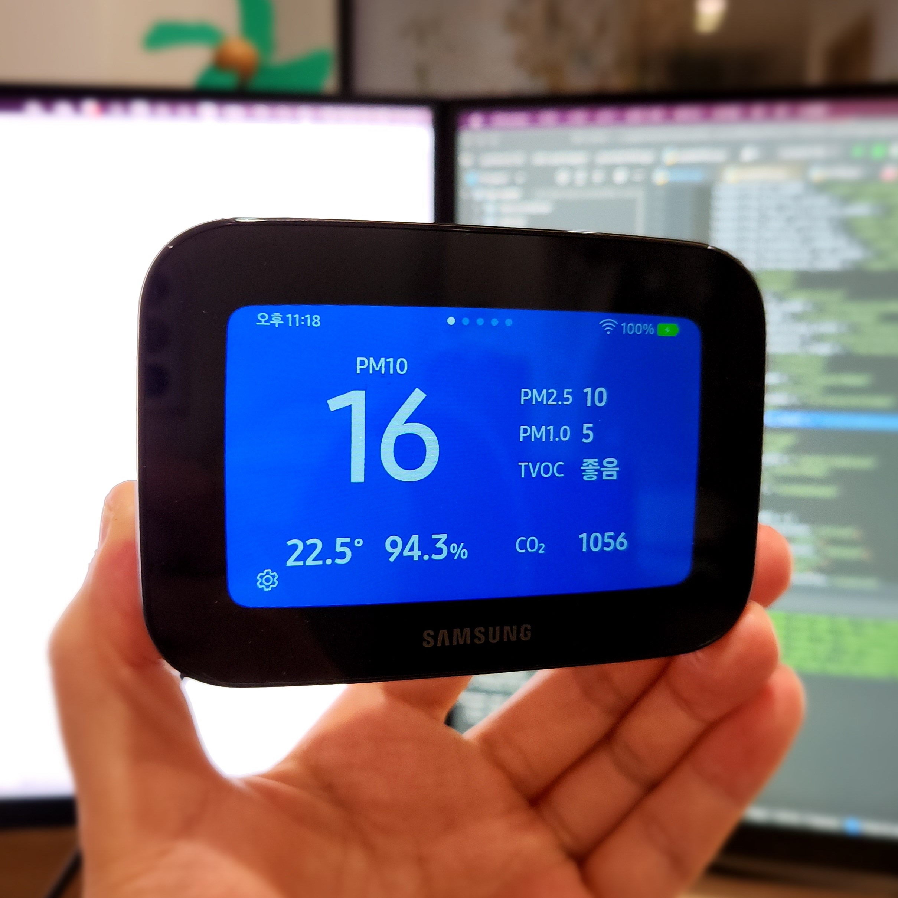
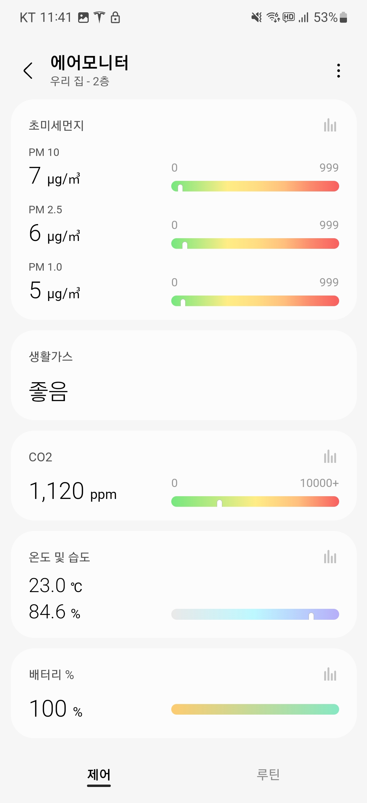
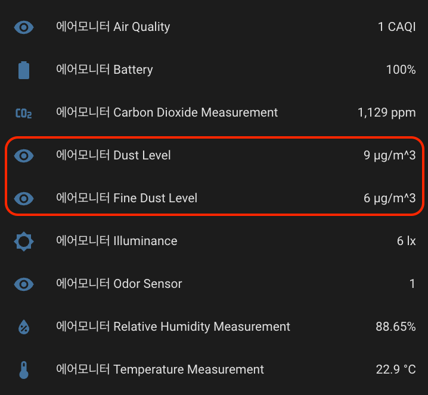
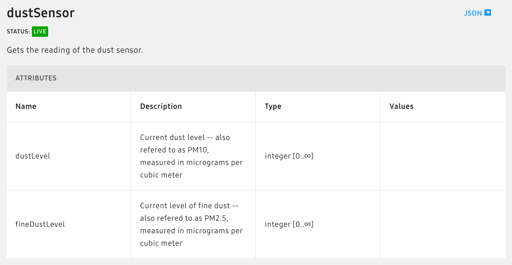
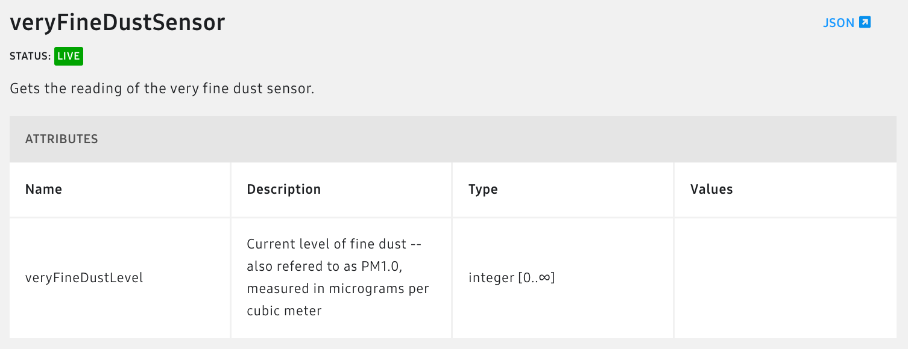
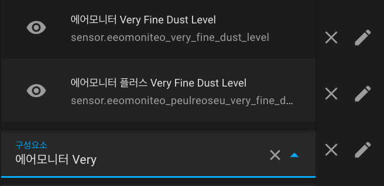
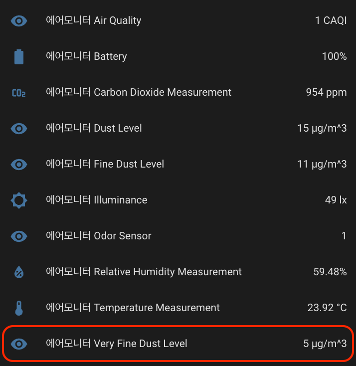

스마트싱스 기기의 정보들 중 일부가 홈 어시스턴트에서 나타나지 않던 현상을 해결한 사례입니다.

## 삼성 에어모니터 (스마트싱스 디바이스)

공기질 측정기로 삼성의 에어모니터를 사용하고 있습니다. (ACM-B1M0S)  
Zigbee가 아닌 Wi-Fi방식이지만, 미세먼지(PM10), 초미세먼지(PM2.5), 극초미세먼지(PM1.0), TVOC(생활가스), 이산화탄소, 온도/습도... 집안 공기질 측정에 필요한 정보들은 전부 제공되고, 스마트싱스를 통해 홈 어시스턴트와 연동이 가능합니다.



스마트싱스 앱에서는 모든 정보가 잘 나타납니다.



홈 어시스턴트에서는 스마트싱스 [Capability](https://developer.smartthings.com/docs/devices/capabilities/capabilities/)의 Attribute명으로 나타납니다.



공기질 측정기를 운용하는 이유가 미세먼지와 이산화탄소 수치를 보기 위해서인데, 홈 어시스턴트에서는 극초미세먼지(PM1.0)수치가  나타나지 않습니다.  
(PM10은 Dust Level, PM2.5는 Fine Dust Level로 표시됩니다)

## SmartThings Capability

SmartThings는 디바이스 정보를 Capability를 통해 제공합니다. PM10 (Dust Level)과 PM2.5 (Fine Dust Level)은 [DustSensor](https://developer.smartthings.com/docs/devices/capabilities/capabilities-reference/#dustSensor)의 Attributes입니다.



먼지센서에는 PM1.0(극초미세먼지)항목이 없습니다. 문서를 좀 더 찾아보니... [veryFineDustSensor](https://developer.smartthings.com/docs/devices/capabilities/capabilities-reference/#veryFineDustSensor)라는 별도의 Capability가 있군요.



미세/초미세와 극초미세먼지를 구분한 이유는 모르겠지만, 이 Capability를 사용하도록 Home Assistant코드를 수정해봅니다.

## [Home Assistant core](https://github.com/home-assistant/core)코드 수정

SmartThings Integration중, 센서 코드는 다음 경로에 있습니다.
**[homeassistant/components/smartthings/sensor.py](https://github.com/home-assistant/core/blob/dev/homeassistant/components/smartthings/sensor.py)**
코드에서 미세/초미세먼지에 해당하는 부분을 찾아봅니다.

```python
Capability.dust_sensor: [
    Map(
        Attribute.fine_dust_level,
        "Fine Dust Level",
        None,
        None,
        SensorStateClass.MEASUREMENT,
        None,
    ),
    Map(
        Attribute.dust_level,
        "Dust Level",
        None,
        None,
        SensorStateClass.MEASUREMENT,
        None,
    ),
],
```

DustSensor는 Capability.dust_sensor, DustLevel은 Attribute.dust_level와 매칭되네요. 스마트싱스 개발문서에서 찾은 veryFineDustSensor와 veryFineDustLevel도 같은 방식으로 사용해봅니다.

```python
Capability.very_fine_dust_sensor: [
    Map(
        Attribute.very_fine_dust_level,
        "Very Fine Dust Level",
        None,
        None,
        SensorStateClass.MEASUREMENT,
        None,
    )
],
```

코드 추가 후 홈 어시스턴트를 실행합니다.

```shell
❯ hass -c config
...
...
  File "/core/homeassistant/components/smartthings/sensor.py", line 504, in <module>
    Capability.very_fine_dust_sensor: [
AttributeError: type object 'Capability' has no attribute 'very_fine_dust_sensor'
```

Capability에 very_fine_dust_sensor는 정의되어 있지 않군요. 저 클래스가 어떻게 생겼는지 보러갑니다.

**site-packages/pysmartthings/capability.py**

```python
class Capability:
    """Define common capabilities."""
    ...
```

음... Capability는 Home Assistant core가 아닌 다른곳에 정의되어있습니다. 찾아보니 pysmartthings라는 라이브러리가 SmartThings의 각종 API들을 파이썬에서 쓸 수 있도록 변환해주는 일을 하는군요. 이 라이브러리 코드를 고쳐봅니다.

## [pysmartthings](https://github.com/andrewsayre/pysmartthings)코드 수정

**pysmartthings/capability.py**

```python
class Capability:
    ...
    very_fine_dust_sensor = "veryFineDustSensor"
    
class Attribute:
    ...
    very_fine_dust_level = "veryFineDustLevel"
```

극초미세먼지 센서(veryFineDustSensor)와 극초미세먼지 수치(veryFineDustLevel)를 추가해줍니다.

## 동작 확인

수정한 pysmatthings코드를 참조하도록 Home Assistant core코드의 링크를 수정하고 실행합니다.



구성요소에서 "에어모니터 Very"까지 입력하니 Very Fine Dust Level항목이 나타납니다. 얼마전에 설치한 에어모니터 플러스도 같이 해결됐군요.



이제 홈 어시스턴트에서도 PM1.0(극초미세먼지) 수치를 확인 할 수 있습니다.

