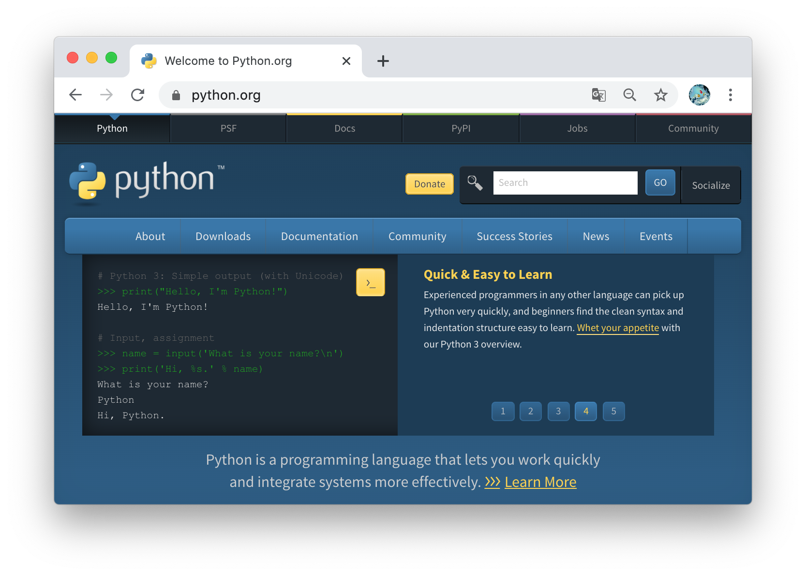
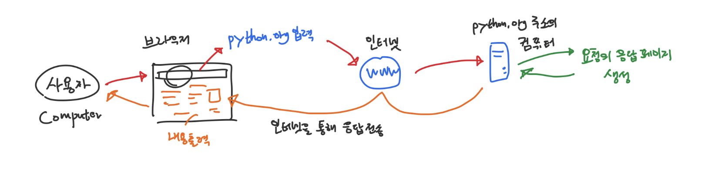
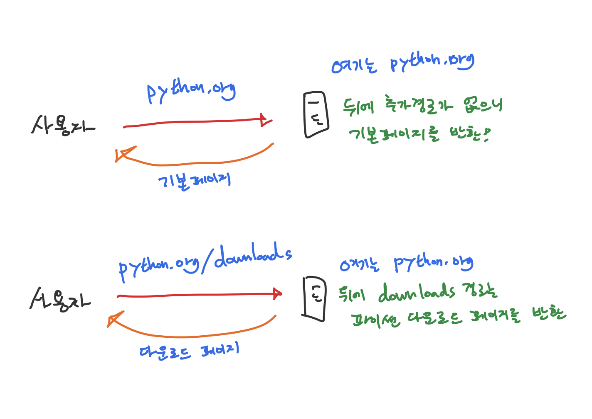
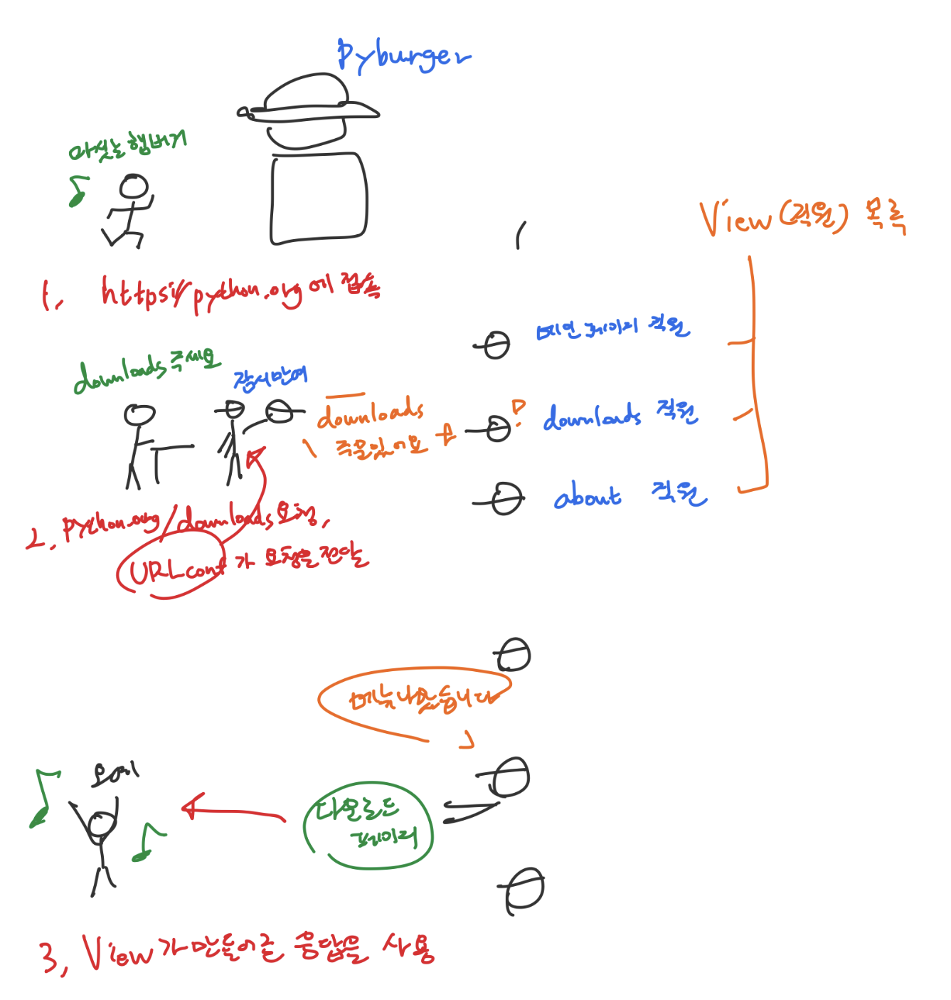

## 웹 페이지가 요청에 응답하는 방법

우리가 웹 사이트에 접속하는 건 매장에서 햄버거를 사는 것과 비슷한 과정을 가진다.

원하는 햄버거를 사기 위해서는 어떻게 하는지 순서를 정리해 보겠다. 가장 간단하게 설명하면, 아래와 같다.

1. 햄버거 매장에 간다
2. 점원에게 주문한다
3. 햄버거를 받는다

위 과정이 실제 웹 사이트에서 어떻게 이루어지는지 알아보자.

파이썬 공식사이트를 예로 들어보겠다. 스마트폰이나 컴퓨터가 있다면, 주소 표시줄에 **[python.org](http://python.org)**를 입력해 보자.

브라우저에 다음과 같은 화면이 나타날것이다.

**[python.org](http://python.org)**의 내용을 보여달라는 **요청(Request)**을 브라우저를 통해서 보냈고, 브라우저는 해당 요청을 어딘가의 컴퓨터로 보낸다. (여기서 어딘가의 컴퓨터가 어떻게 결정되는지는 아직 몰라도 괜찮다)

이 페이지의 내용은 인터넷상의 어떤 컴퓨터에서 보내진 것이며, 해당 컴퓨터는 우리의 **요청(Request)**을 받은 후 **응답(Response)**을 되돌려 준 것이다.

이 과정을 간단히 도식화하면 아래와 같다.

**python.org주소에 대한 요청이 처리되는 과정**

사용자 → 브라우저에 **[python.org](http://python.org)**요청 → 인터넷을 통해 **[python.org](http://python.org)**에 해당하는 컴퓨터에 요청을 전달 -> 해당 컴퓨터는 요청에 응답하는 내용을 전달 -> 인터넷을 통해 사용자의 컴퓨터로 응답이 돌아옴 -> 브라우저는 이 내용을 표시 -> 사용자는 표시된 내용(위 화면)을 확인

하지만 대부분의 웹 사이트는 여러개의 페이지를 가진다. 다른 화면을 보고싶고, 이를 햄버거를 사는 과정으로 나타낸다면 아래와 같이 한 단계가 추가된다.

1. 햄버거 가게에 간다
2. **"원하는" 햄버거를 고른다**
3. 고른 햄버거를 점원에게 주문한다
4. 주문한 햄버거가 나온다

여기에서 **원하는 햄버거**는 우리가 **보고자 하는 페이지**에 해당한다. 우리가 브라우저에 입력한 **[python.org](http://python.org)**는 인터넷 상의 어떤 컴퓨터(위 예로 따지면, **특정 햄버거 가게**에 해당한다)를 나타내며, 특별히 어떤 페이지도 요청하지 않는다면 기본 페이지를 돌려준다. 위 파이썬 공식 홈페이지의 화면은, 우리가 어떠한 특별한 페이지도 요청하지 않았을 경우의 결과이다.

그러면 기본페이지가 아닌 다른 페이지를 요청해보자. 원하는 메뉴를 골라 점원에게 알려주듯, 우리는 브라우저를 통해 우리가 원하는 메뉴가 무엇인지를 알려주어야 한다. 원하는 페이지는 브라우저의 주소표시줄에 입력한 주소로 알려 줄 수 있다.

**python.org가** 요청을 응답할 컴퓨터일 때, 추가로 입력한 다른 텍스트는 특정 페이지를 요청하는데에 사용된다. **[python.org/downloads](http://python.org/downloads)** 라는 주소를 입력해보자. 이 주소는 **[python.org](http://python.org)**라는 컴퓨터에서 **downloads**라는 페이지를 요청한는 의미이다.

**python.org에 기본페이지 요청과 다운로드페이지 요청**

여기서 입력한 텍스트는 **URL(Uniform Resource Locator)**이라고 부른다. URL은 웹 페이지를 찾기 위한 주소를 의미한다. 앞으로 웹 사이트의 주소는 URL이라는 단어를 사용해 나타내겠다.

## Django가 요청에 응답하는 방법

Django가 요청에 응답하는 방법 역시 햄버거를 사는것에 비유해보자. 전체적으로 개념은 같지만, 비유에 Django가 사용하는 용어들을 사용하겠다.

#### 1. URL로 사용자의 요청이 전달된다.

> 어떤 햄버거가게로 갈지 정한다. 위 예제의 경우, python.org라는 주소에 요청을 전달한다.

URL은 인터넷상에서 자원의 위치를 나타낸다. 여기서는 python.org라는 주소의 컴퓨터에 해당한다. [https://python.org로](https://python.xn--org-ky7m) 시작하는 URL은 항상 python.org내용을 제공하는 컴퓨터로 연결된다.

#### 2. 요청에 응답 할 수 있는 함수로 요청을 전달한다

> **점원**에게 원하는 메뉴를 주문한다 감자튀김을 주문했다면 튀김 담당 직원에게, 햄버거를 주문했다면 햄버거 담당 직원에게 전달하듯, **주문한 메뉴**를 만드는 직원에게 주문사항을 전달한다

여기서 **점원**은 Django에서 **URL설정(URLconf)**에 해당한다. 점원이 주문한 메뉴가 무엇인지 구분하듯이, Django의 URL설정은 요청자가 브라우저의 주소표시줄로 전달한 URL로부터 어떤 페이지를 요청했는지 구분해준다.

점원이 주문받은 메뉴를 처리할 **직원**은 Django에서 View에 해당한다. 이 View는 함수이다.

> **💡 Tips. 함수란?** 함수는 입력값을 처리해 값을 반환(return)해주는 기능을 말한다. 교육과정에서 $f(x) = 2x + 3$ 과 같은 수식을 배운적이 있을 것이다. $f(x)$함수는 에 입력값으로 7을 지정하면, 우측의 처리과정으로 17을 반환해준다. 프로그래밍에서의 함수 역시 입력값을 처리하는 로직(과정)을 가지는 기능을 말한다. Django의 View함수는 외부 URL로부터의 요청(request)을 입력값으로 받아 브라우저에 표시할 수 있는 내용을 반환해주는 로직을 가진다.

#### 3. View 함수는 요청을 처리 한 후, 응답을 되돌려준다

> **주문한 메뉴**를 담당하는 직원은 주문사항을 적절히 처리하고 메뉴를 만들어 내보낸다

여기서 **만들어진 메뉴**는 Django의 **응답(Response)**에 해당한다. 이 응답은 브라우저가 해석할 수 있는 형태의 데이터이다.

#### 4. 응답은 요청자의 브라우저로 전달되며, 브라우저는 응답을 해석해서 사용자에게 보여준다.

> **만들어진 메뉴**가 나왔음을 주문자에게 알리고, 주문자는 해당 메뉴를 가져간다

View함수가 돌려준 **응답(Response)**은 브라우저가 읽을 수 있는 형태이며, 이 응답은 인터넷을 통해 요청을 발송했던 브라우저로 전달된다. 브라우저는 전달받은 내용을 화면에 표시한다.

지금까지 어떻게 웹 사이트를 볼 수 있는지, 웹 사이트에 어떻게 요청하며 사이트는 어떤 응답을 돌려주는지, 그리고 Django의 어떤 기능들이 그 역할을 하는지 이론적으로 알아보았다. 이제 위 과정들을 코드로 작성하고, 실제 동작을 살펴보자.