## Step3.1. Python 설치

> **💡 Tips. 초기화**  
개발환경 구성 시 기존에 설치된 프로그램이나 개발환경과 충돌이 있을 수 있으므로, 사용하던 운영체제를 초기화하고 진행할 것을 강력히 권장한다. 책에서는 다음 두 운영체제에서 설치 및 실습을 진행했다.  
•  Windows10 Education (Build: 19044.1826)  
•  macOS Monterey (12.4)  
새로운 OS에서는 개발환경 설정이 달라질 수 있다. 책에 설명된 것 보다 최신의 운영체제를 사용한다면, [https://django.ac/env](https://django.ac/env/mac)에서 업데이트 된 내용을 확인 할 수 있다.

### Python 다운로드

https://python.org/downloads에서 다운로드 후 설치한다. 이 책에서는 3.11버전을 사용하지만, 추후 나올 버전에서도 문제없이 작동 될 것이다. 책과 환경을 동일하게 맞추고 싶다면 링크들 중 자신의 OS를 클릭해서 나오는 목록에서 3.11.x버전을 선택해서 다운로드하자.

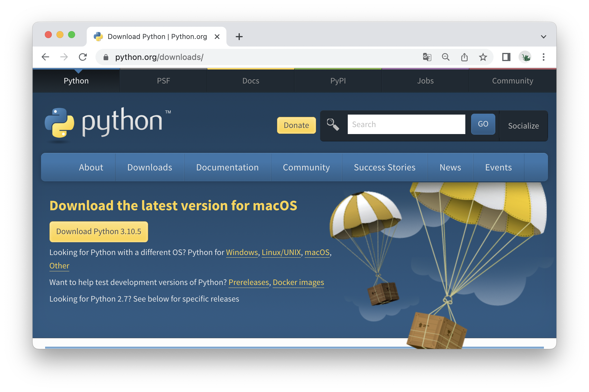
Python 다운로드 페이지
{:.img-caption}


릴리즈 목록에서 원하는 버전을 다운로드 할 수 있다
{:.img-caption}

#### Windows에서의 Python설치

1. 설치 시 **Add Python 3.10 to PATH** 항목을 체크해준다. 옵션이 체크되어 있어야 Windows의 시스템 어디서든 설치한 파이썬을 찾을 수 있다.

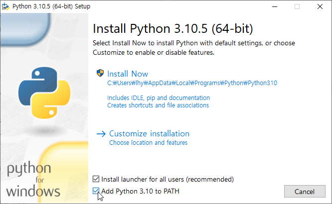

2. 설치 후 나타나는 **Disable path length limit** 버튼을 눌러준다. Windows의 기본값(260글자)보다 긴 PATH경로를 가져도 오류가 발생하지 않게 해주는 옵션이다.

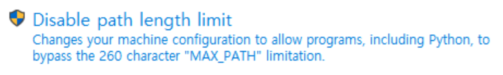


## Step3.2. PyCharm Community 설치

### 3.2.1. PyCharm Community Edition 다운로드

개발도구로는 PyCharm을 사용한다. PyCharm은 JetBrains에서 제작한 파이썬 IDE(통합 개발 환경, Integrated Development Environment)로, 유료버전인 Professional과 무료버전인 Community Edition으로 나뉜다.

Professional버전은 Django개발 시 더 강력한 지원을 해주므로, 원한다면 Professional 30일 체험판을 사용해보는것도 좋다. 학생이라면 본인이 소속된 학교 이메일을 사용해서 교육용 라이선스를 받아 Professional버전을 무료로 사용할 수 있다. 실습에서는 무료버전인 Community버전을 사용한다.

- 다운로드 링크: [https://www.jetbrains.com/pycharm/download](https://www.jetbrains.com/pycharm/download/#section=mac)
- Jetbrains 교육용 라이선스: https://www.jetbrains.com/community/education

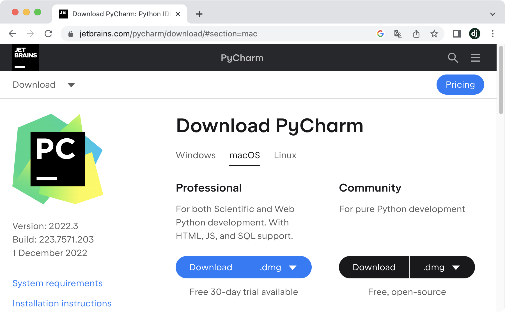

PyCharm 다운로드 페이지
{:.img-caption}

#### PyCharm Community Edition 설치 - Windows

설치 시 옵션에서 모든 선택항목을 체크한다.

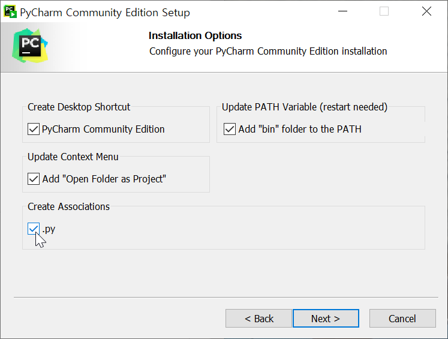

#### PyCharm Community Edition 설치 - macOS

설치 프로그램(dmg)을 열고 왼쪽의 아이콘을 우측 Applications디렉터리로 드래그한다.

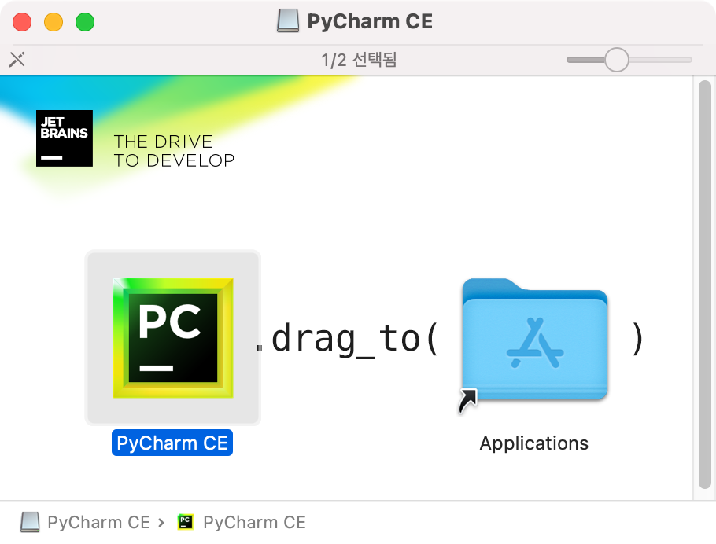

### 3.2.2. 새 프로젝트 생성

PyCharm에서 새 프로젝트를 생성해보자. 프로젝트명은 **HelloWorld**를 사용한다.

1. **설치한 PyCharm을 실행하고 New Project버튼을 누른다.**
   
    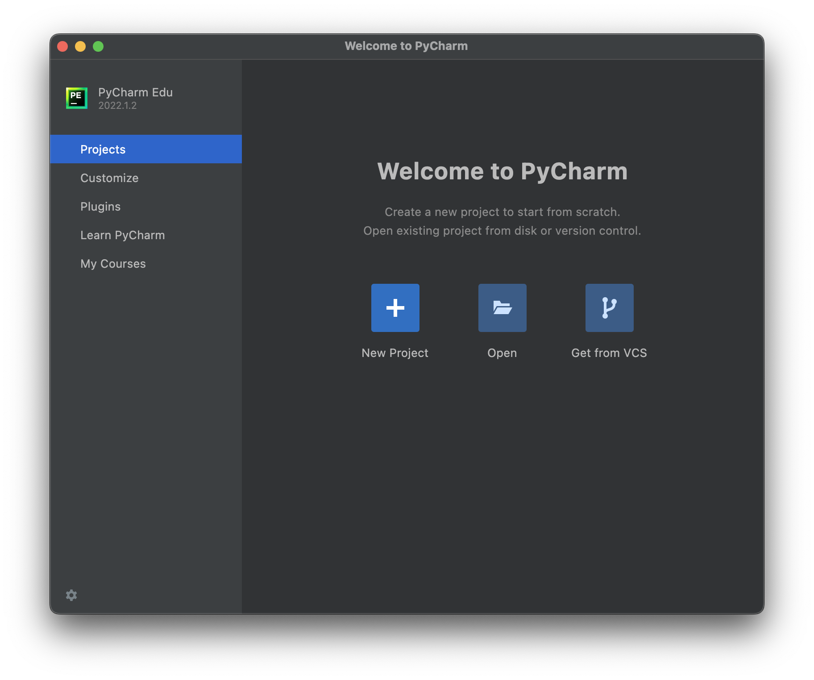
    
2. **New Project 설정**
    1. **Location: 프로젝트 위치**
    경로의 마지막에 **pythonProject**가 기본값으로 입력되어있다. 마지막의 **pythonProject**부분을 원하는 이름(HelloWorld)로 바꾼다. 
    2. **Virtualenv: 가상환경**
       각각의 프로젝트별로 사용하는 파이썬 버전이나 설치된 라이브러리들을 분리해주는 파이썬 가상환경을 설정한다.
        1. **Location: 가상환경 위치**
        프로젝트 위치와는 다른, 개발환경에서 설치한 파이썬 라이브러리들을 보관할 위치이다. PyCharm에서 제공하는 기본값을 사용한다.
        2. **Base interpreter: 파이썬 인터프리터**
        가상환경에 어떤 버전의 파이썬을 사용할지 정한다.
    3. **Create a main.py welcome script**
    프로젝트에 main.py파일을 추가하는 옵션이다. 사용하지 않으니 해제한다.
3. **설정화면 확인**
   Windows에서 macOS에서의 Location과 Base interpreter의 위치가 다르다.
    1. **Windows**
    Location은 C:₩로 시작
         Base interpreter위치는 C:₩Users₩{사용자명}₩AppData….로 시작
        
        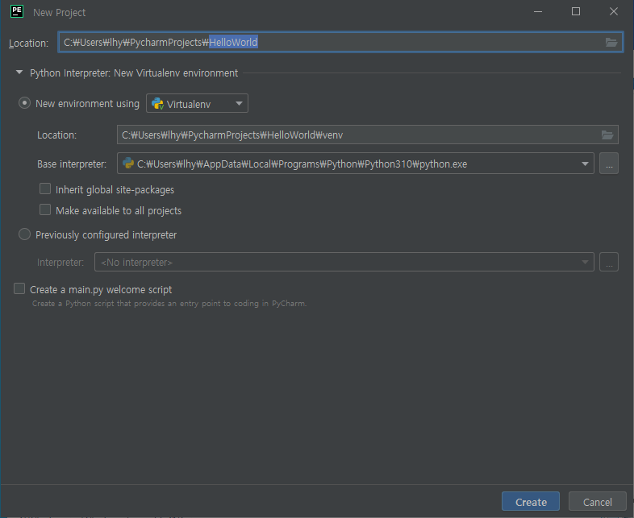
        PyCharm New Project - Windows
        {:.img-caption}
        
    2. **macOS**
    Location은 /User로 시작
         ****Base interpreter위치는 /usr/local/bin..으로 시작
        
        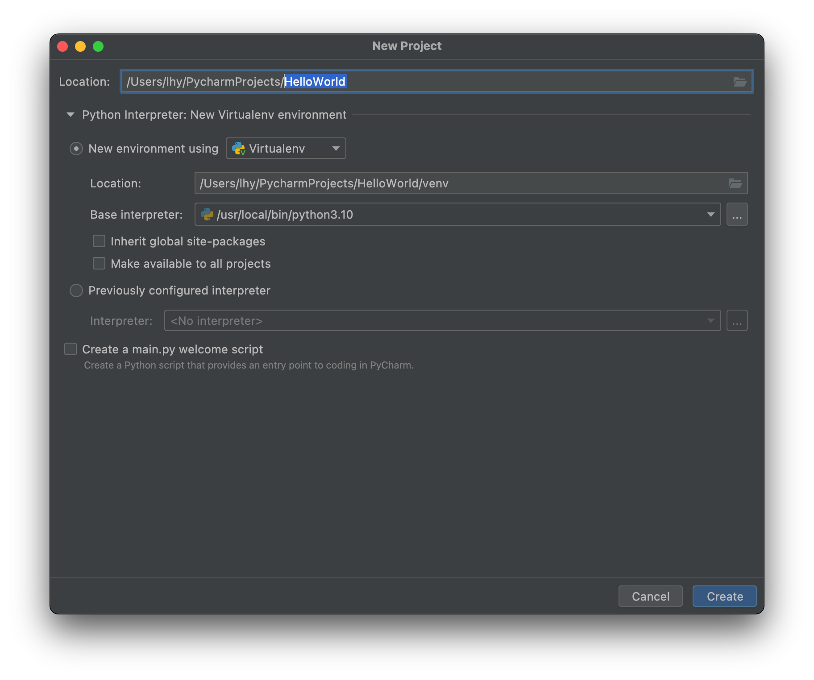
   
4. **파이썬 버전, 가상환경 확인**
   Create를 눌러 프로젝트를 시작한다. 좌측 위에 가상환경 내용이 저장될 venv 디렉터리가 있고, 우측 아래에 Python 3.11 (HelloWorld)로 가상환경이 적용된 3.11버전의 파이썬을 사용함을 확인한다.
   
   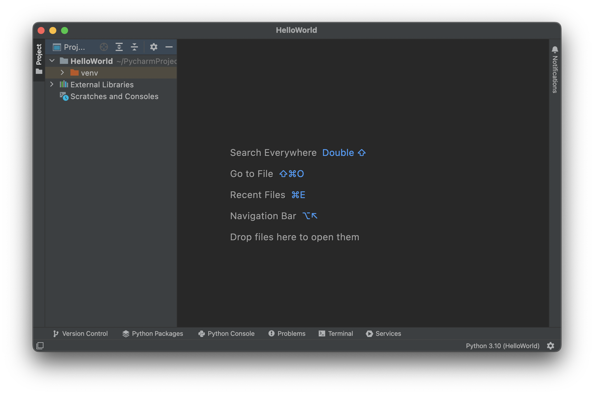
   

### 3.2.3. Hello, World!

프로젝트에 파이썬 코드를 추가하고 실행해보자.

#### 파이썬 파일(.py) 생성

좌측 상단의 최상위 프로젝트 디렉터리(HelloWorld) 우클릭 후 New → Python File을 클릭

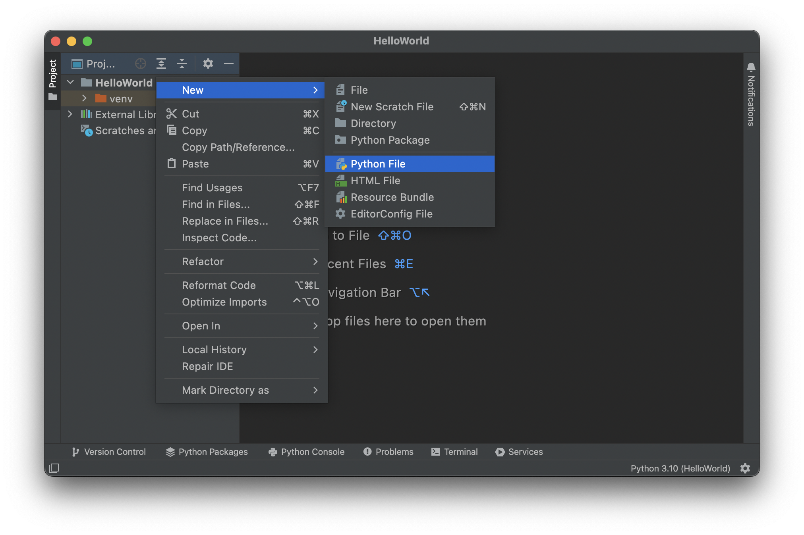

파일 이름은 main.py를 사용한다.

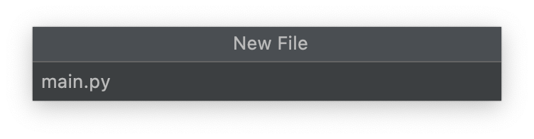

#### 코드 입력

생성한 파일을 더블클릭하고, 우측의 코드 입력부분에 아래와 같이 입력한다.

```python
import sys

print(sys.version)
print("Hello, World!")
```

#### 터미널 실행

아래 메뉴들 중 "Terminal"버튼을 클릭한다.

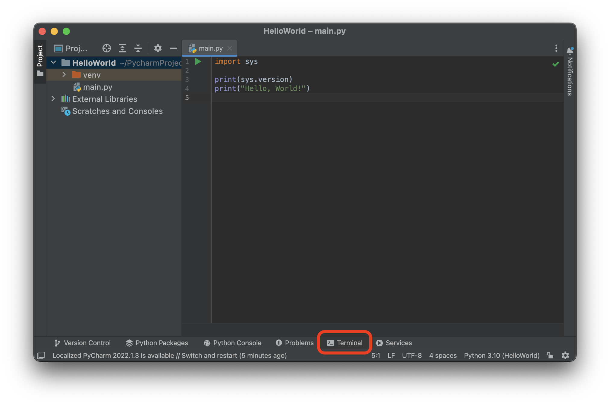

#### 파이썬 코드 실행

터미널에 **`python main.py`**입력 후 엔터

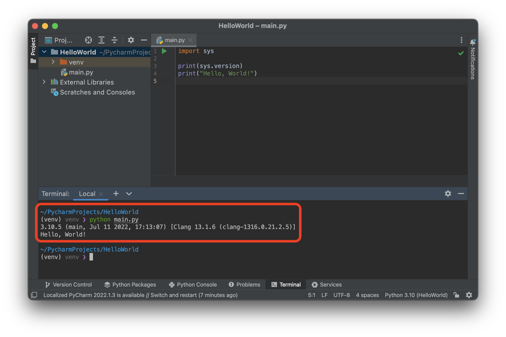
파이썬 버전과 "Hello, World!"문자열이 출력된다.
{:.img-caption}


## Step3.3.A. 터미널 설정 (Windows)

### 터미널 실행

**Alt + F12** 또는 ****하단 메뉴의 Terminal버튼을 클릭해 터미널을 실행한다.

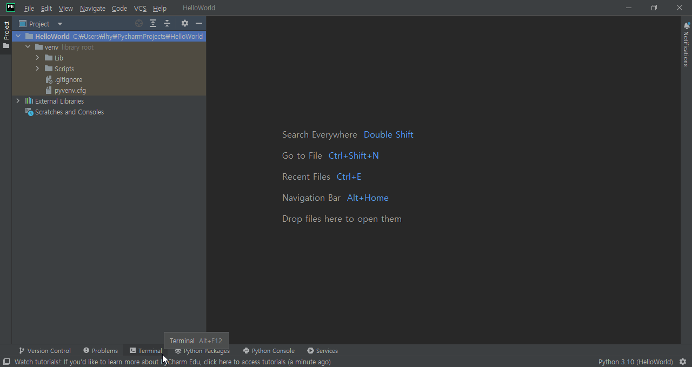

### 보안 오류 해결

터미널을 실행했을 때 `이 시스템에서 스크립트를 실행할 수 없으므로….
CateogryInfo: 보안 오류 ParentContainsErrorRecordException` 와 같은 메시지가 뜨는 경우, 셸(Shell)의 보안설정을 변경해주어야 한다.

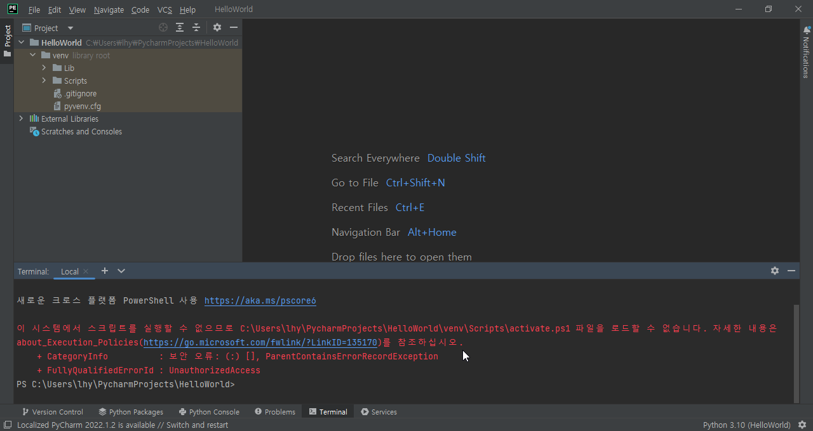
셸에서 ParentContainsErrorRecordException오류가 발생한 경우
{:.img-caption}

### PowerShell에서 보안 설정 변경

시작버튼을 누르고 powershell을 검색, Windows PowerShell을 우클릭 → 관리자 권한으로 실행한다.

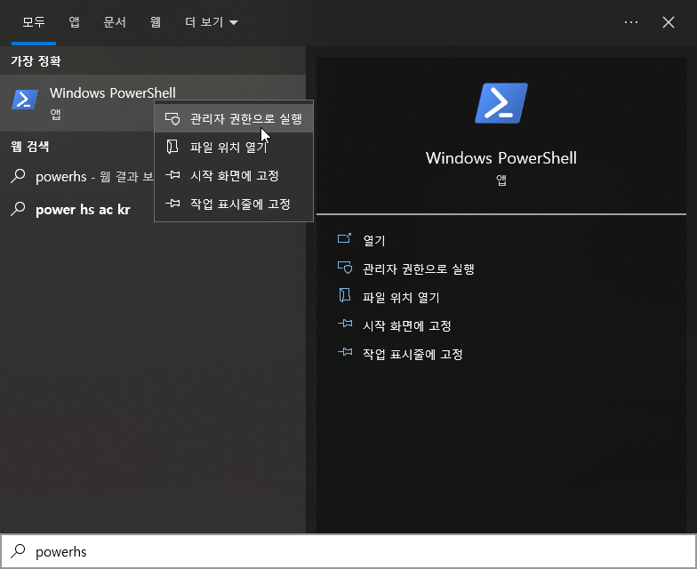

**Set-ExecutionPolicy Unrestricted** 명령어로 셸 스크립트 실행 보안설정 변경

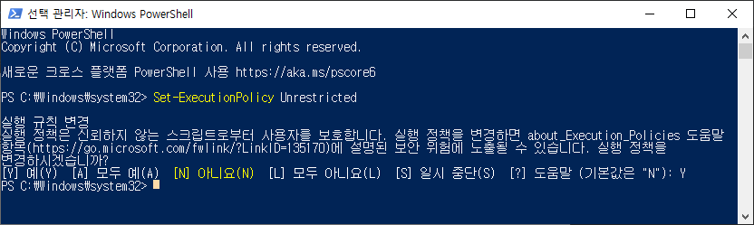

설정 변경 후 PyCharm을 재시작한다.

### 파이썬 버전 확인

보안설정 변경 후 터미널을 시작하면 오류메시지가 발생하지 않으며, 명령줄 좌측에 (venv)가 표시된다. (venv)는 가상환경이 적용되었될 경우 나타난다.

**python —version**명령어로 설치한 파이썬이 인식되었는지 확인해본다.

**option + F12** 또는 하단 메뉴의 Terminal버튼을 클릭해 터미널을 실행한다.

> **💡 Tips. macOS - 표준 기능키**  
**option + F12**로 볼륨이 조절된다면 option + fn + F12를 사용한다. 이 설정은 키보드 설정의 **F1, F2등의 키를 표준 기능 키로 사용** 옵션에서 변경할 수 있다.

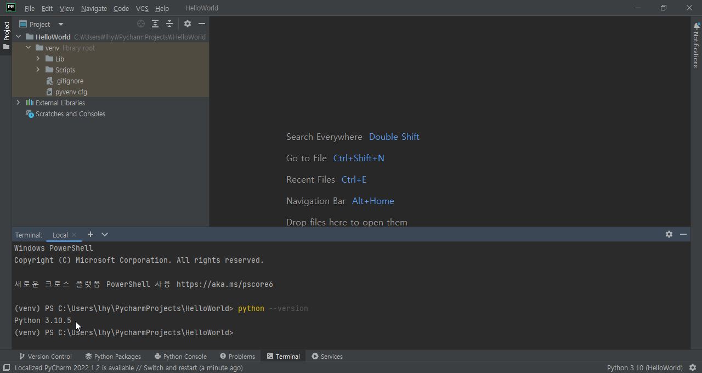

터미널이 실행된다. 좌측의 **(venv)**는 가상환경이 적용되었다는 뜻이다. 파이썬 버전을 확인해본다.

```bash
(venv) ... HelloWorld % python --version             
Python 3.11.x
```

다운로드 한 파이썬의 버전이 출력되는지 확인한다. 앞으로 터미널 명령어를 표시할 때는 (venv) … HelloWorld부분은 생략하며, 터미널 명령어는 ❯ 기호 뒤에 나타낸다.

> **💡 Tips. 프롬프트의 형태**  
명령어를 입력하기 전에 좌측에 나타나는 문자는 환경에 따라 아래와 같이 %나 ❯로 표시된다.  
• (venv) lhy@lhy HelloWorld %  
• (venv) HelloWorld ❯   
필자의 스크린샷과 다른 문자가 나타날 수 있으나 모양차이만 있을 뿐, 기능은 같다.

## Step3.3.B. 터미널 설정 (macOS)

**option + F12** 또는 하단 메뉴의 Terminal버튼을 클릭해 터미널을 실행한다.

> **💡 Tips. macOS - 표준 기능키**  
**option + F12**로 볼륨이 조절된다면 option + fn + F12를 사용한다. 이 설정은 키보드 설정의 **F1, F2등의 키를 표준 기능 키로 사용** 옵션에서 변경할 수 있다.

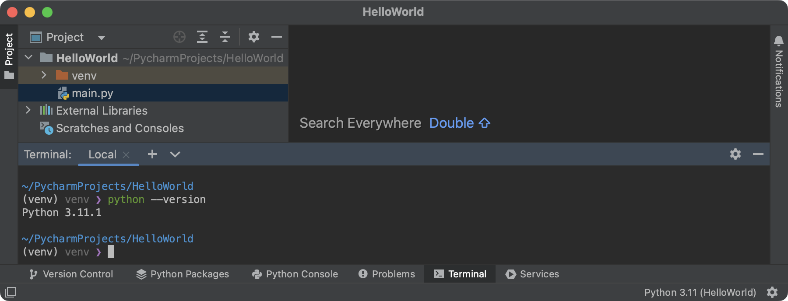터미널이 실행된다. 좌측의 **(venv)**는 ****가상환경이 적용되었다는 뜻이다. 파이썬 버전을 확인해본다.

```bash
(venv) ... HelloWorld % python --version             
Python 3.11.x
```

다운로드 한 파이썬의 버전이 출력되는지 확인한다. 앞으로 터미널 명령어를 표시할 때는 (venv) … HelloWorld부분은 생략하며, 터미널 명령어는 ❯ 기호 뒤에 나타낸다.

> **💡 Tips. 프롬프트의 형태**  
명령어를 입력하기 전에 좌측에 나타나는 문자는 환경에 따라 아래와 같이 %나 ❯로 표시된다.  
• (venv) lhy@lhy HelloWorld %  
• (venv) HelloWorld ❯   
필자의 스크린샷과 다른 문자가 나타날 수 있으나 모양차이만 있을 뿐, 기능은 같다.
>

## Step3.4. 터미널 사용법

터미널에서 탐색기처럼 경로를 이동하고, 디렉터리를 생성하는 간단한 명령어들을 알아본다.

#### pwd(print working directory)

현재 작업중인 위치 출력

```bash
❯ pwd
Windows: C:₩Users₩{사용자명}₩PyCharmProjects/HelloWorld
macOS:   /Users/lhy/PycharmProjects/HelloWorld
```

#### cd(change directory)

디렉터리 변경  
..은 상위 디렉토리를 나타낸다.

```bash
❯ pwd
Windows: C:₩Users₩{사용자명}₩PyCharmProjects/HelloWorld
macOS:   /Users/lhy/PycharmProjects/HelloWorld

❯ cd ..  ## 한 단계 상위 디렉토리로 이동
❯ pwd
Windows: C:₩Users₩{사용자명}₩PyCharmProjects
macOS:   /Users/lhy/PycharmProjects

❯ cd HelloWorld  ## 입력한 디렉토리 아래로 이동
❯ pwd
Windows: C:₩Users₩{사용자명}₩PyCharmProjects/HelloWorld
macOS:   /Users/lhy/PycharmProjects/HelloWorld

```

#### cd ~ (물결표, tilde)

홈 디렉터리로 이동  
/Users/{현재 로그인한 사용자명} 디렉터리로 이동한다.

```bash
❯ pwd
Windows: C:₩Users₩{사용자명}₩PyCharmProjects/HelloWorld
macOS:   /Users/lhy/PycharmProjects/HelloWorld

❯ cd ~
❯ pwd
Windows: C:₩Users₩{사용자명}
macOS:   /Users/lhy
```

#### ls -al(list segments)

현재 위치의 모든 디렉터리/파일 출력

> Windows에서는 -al없이 ls명령어만 사용한다.
> 

-a 옵션: .(dot)으로 시작하는 이름을 포함
-l 옵션: 긴 포맷으로 출력

```bash
❯ ls -al  ## Windows에서는 ls
total 0
drwxr-xr-x  4 lhy  staff  128  7 19 07:40 .
drwxr-xr-x  4 lhy  staff  128  7 19 07:40 ..
drwxr-xr-x  8 lhy  staff  256  7 19 07:47 .idea
drwxr-xr-x  6 lhy  staff  192  7 19 07:40 venv
```

#### mkdir(make directory)  

디렉터리 생성

```bash
❯ mkdir .temp
❯ ls -al  ## Windows에서는 ls
total 0
drwxr-xr-x  5 lhy  staff  160  7 19 17:56 .
drwxr-xr-x  4 lhy  staff  128  7 19 07:40 ..
drwxr-xr-x  8 lhy  staff  256  7 19 07:47 .idea
drwxr-xr-x  2 lhy  staff   64  7 19 17:56 .temp  ## 생성된 디렉터리
drwxr-xr-x  6 lhy  staff  192  7 19 07:40 venv
```