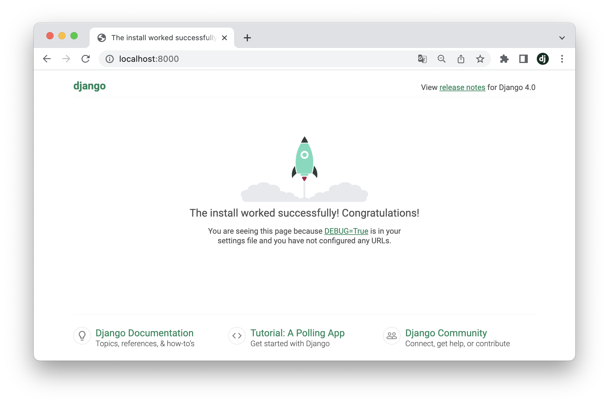
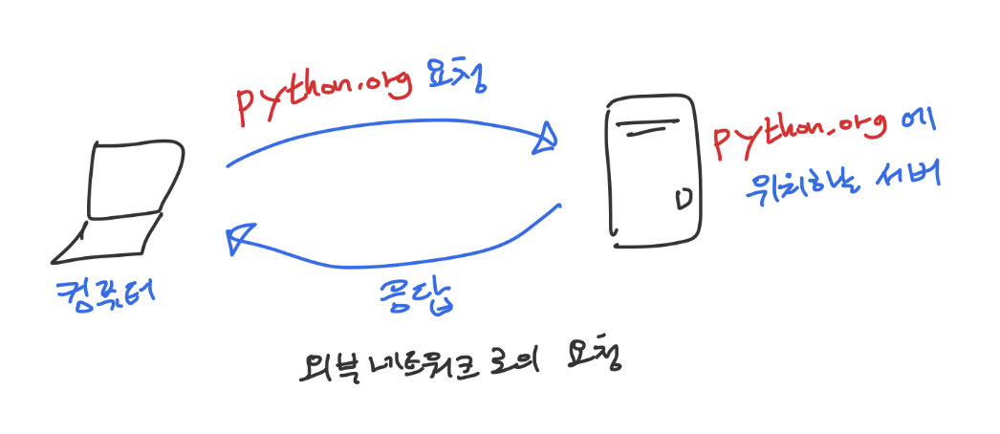
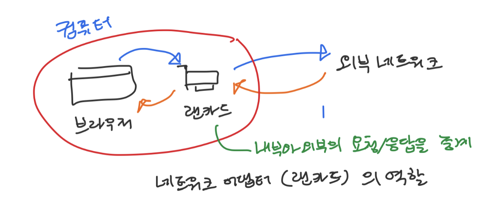
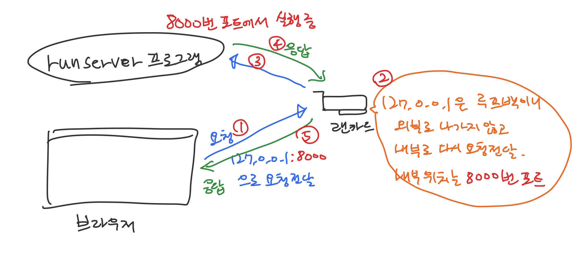
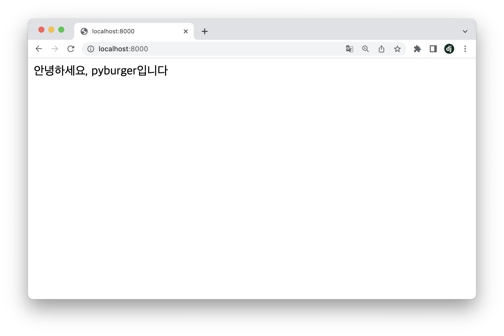
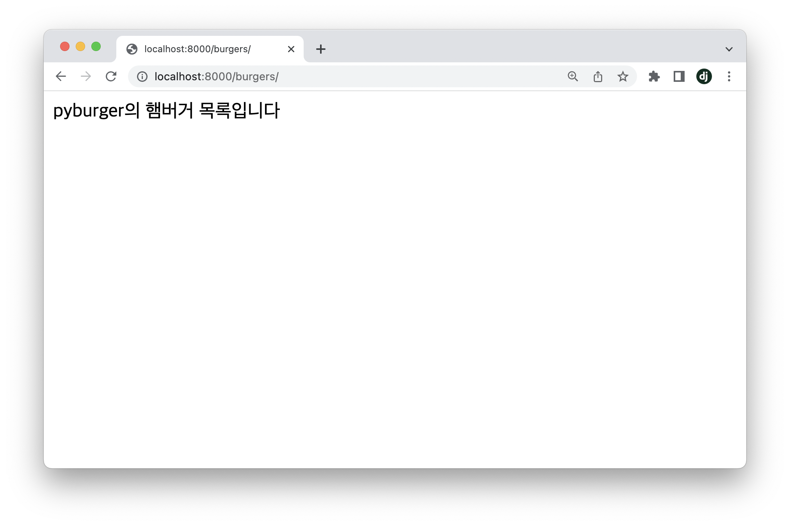
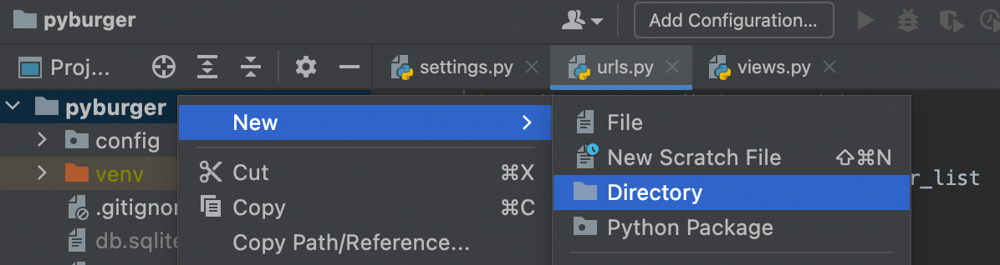
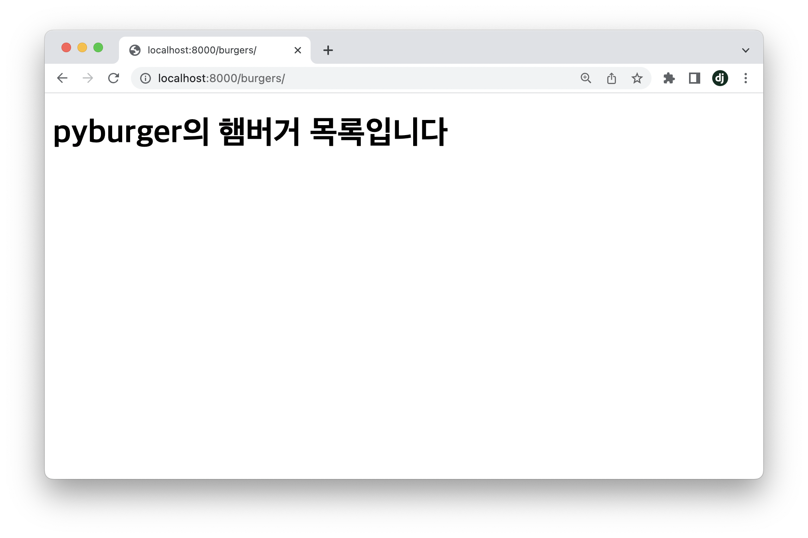
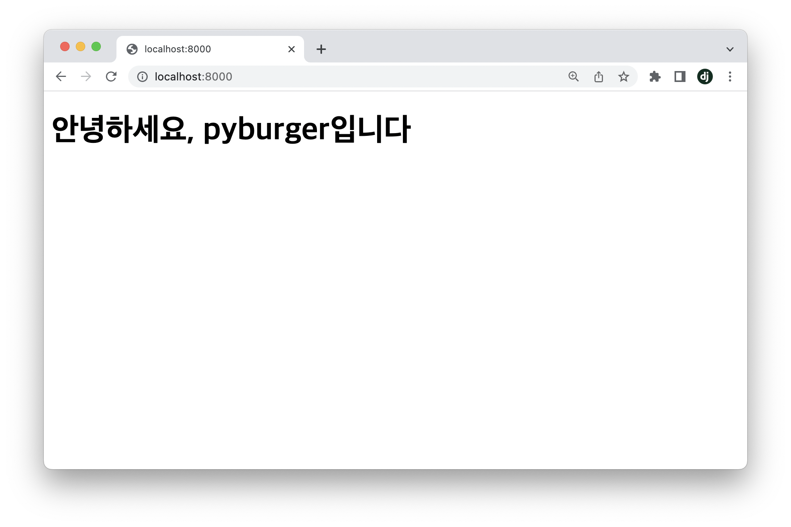

## Step4.1. Django의 디자인 패턴

본격적으로 Django프로젝트를 시작해보기 전에, Django에서 코드를 분리하는 단위에 대해 알아본다. 처음보는 용어가 많겠지만, 소프트웨어 개발에는 이런 개념도 있구나 하는 느낌으로 가볍게 읽으며 넘어가자.

### 4.1.1. 디자인 패턴

소프트웨어 디자인 패턴(software design pattern)은 소프트웨어를 개발 할 때 공통적으로 발생하는 문제들을 해결하기 위한 재사용 가능한 해결책이다. 실제 코드를 말하는 것은 아니며, 코드를 작성하기 위한 일종의 서식이다.

### 4.1.2. MTV 패턴

모델-템플릿-뷰(model-template-view)는 디자인 패턴의 일종이며, Django에서 역할에 따라 코드를 분리하는 가이드로 사용한다.

#### Model

모델(Model)은 Django와 데이터베이스를 연결시켜주는 코드이며, 데이터의 형태를 나타낸다. 일반적으로 각각의 모델은 데이터베이스 테이블과 매핑된다.

모델은 다음 속성들을 가진다.

- 파이썬의 클래스를 사용하며, 모든 Model클래스는 django.db.models.Model클래스를 상속받는다
- 각각의 모델 속성은 데이터베이스 필드를 나타낸다.

파일명은 기본값으로 **models.py**를 사용한다.

```python
class DjangoModel(models.Model):
    name = models.CharField("이름")
```

#### Template

템플릿(Template)은 웹 브라우저로 돌려줄 코드이며, 사용자에게 제공될 결과물의 형태를 나타낸다. HTML을 사용해서 나타내며, Django에서는 templates디렉터리 내에 HTML파일을 사용한다.

```html
<!DOCTYPE html>
<html lang="ko">
	<body>
		<h1>DjangoTemplate</h1>
	</body>
</html>
```

#### View

View는 사용자의 요청을 받아 처리하는 웹 사이트의 로직을 가지는 코드이다. 파이썬의 **함수(Function)**를 사용한다.

파일명은 기본값으로 **views.py**를 사용한다.

```python
def django_view(request):
    return HttpResponse("Django View")
```

> **💡 Tips. MTV와 MVC패턴**  
Django의 MTV패턴은 유명한 소프트웨어 디자인 패턴인 모델-뷰-컨트롤러(model-view-controller, MVC)와 같은 패턴이며, 부르는 명칭에만 차이가 있다.  
• MVC의 **View** → MTV의 **Template**  
• MVC의 **Controller** → MTV의 **View**  
각각의 패턴에서 **View**가 의미하는 바가 다름에 주의하자.
> 

> **📄  Docs. Django - Why Django don’t use the standard names?**  
Django가 MVC대신 MTV라는 이름을 사용하는 이유  
https://docs.django.ac/mtv


## Step4.2. Django설치와 프로젝트 생성

### 4.2.1. PyCharm 프로젝트 생성

Chpter3의 개발환경 구성을 참조하여 새 PyCharm프로젝트를 생성한다. 프로젝트명은 **pyburger**를 사용한다.

### 4.2.2. Django 설치

**Step3.3**의 터미널 설정을 참조하여 PyCharm에서 새 프로젝트를 생성한다. 프로젝트명은 pyburger를 사용한다.

프로젝트 생성 후, PyCharm에서 가상환경이 적용된 터미널을 실행하고(Step3.3을 참조) 파이썬 패키지 관리 시스템인 pip를 사용해서 Django를 설치해보자. 이 책에서는 Django 4.x버전을 사용하므로, 5버전 미만의 Django를 설치한다.
> **💡 Tips. 버전**  
Django의 버전은 {major}.{minor}.{patch}로 나타내며, 이 책은 major버전이 4인 모든 코드에 대해 동작을 보장한다.  
추후 major버전이 5나 6인 Django가 출시되어도, 학습목적으로는 과거 버전의 Django도 충분히 사용할 수 있으므로 이 책을 실습할때는 **pip install 'django<5'**로 Django의 major버전을 4로 지정하도록 한다.
> 

> **💡 Tips. 셸(Shell)과 터미널(Terminal), 커맨드라인 인터페이스(Command-line interface, CLI)**  
 셸(Shell)은 사용자의 입력을 운영체제(OS)로 전달해주는 프로그램이며, 터미널(Terminal)은 셸을 실행하기 위한 프로그램이다. 셸도 프로그램이고 터미널도 프로그램이지만, 셸은 특정 값을 운영체제로 전달해주는 역할을 한다면 터미널은 그보다 바깥에서 사용자의 입력을 받아 셸에 전달하고, 셀이 운영체제로부터 받은 값을 보여주는 역할을 한다.  
터미널을 사용해 컴퓨터와 사용자가 상호작용하는 방식을 커맨드라인 인터페이스라 부르며, 이러한 인터페이스를 제공하는 프로그램을 셸이라 부른다. 이들 셋은 유사한 개념으로 사용되며, 셸, 터미널, 커맨드라인에 입력하라는 말은 같은 의미로 취급된다.
> 

```bash
(venv) ❯ pip install 'django<5'
Collecting django<5
  Downloading Django-4.0.4-py3-none-any.whl (8.0 MB)
     ━━━━━━━━━━━━━━━━━━━━━━━━━━━━━━━━━━━━━━━━ 8.0/8.0 MB 21.9 MB/s eta 0:00:00
Collecting sqlparse>=0.2.2
  Using cached sqlparse-0.4.2-py3-none-any.whl (42 kB)
Collecting asgiref<4,>=3.4.1
  Downloading asgiref-3.5.1-py3-none-any.whl (22 kB)
Installing collected packages: sqlparse, asgiref, django
Successfully installed asgiref-3.5.1 django-4.0.4 sqlparse-0.4.2
```

Django가 동작하기 위해 함께 필요한 패키지들도 설치된다. 제대로 설치되었는지 확인하기 위해 다음 명령어로 설치된 Django의 버전을 확인해보자.

```bash
(venv) venv ❯ django-admin --version
4.x.x
```

5버전 미만이며, 4.x중에는 최신버전이 설치되므로 `4.`뒤의 숫자는 설치하는 시점에 따라 각자 다르게 나타난다. 이 책의 코드들은 Django 4.0, 4.1, 4.2 버전을 모두 지원하므로, major버전이 4인지만 확인하자.

### 4.2.3. Django 프로젝트 생성

```bash
# config다음 .을 입력하기 전에 공백 한 칸이 반드시 있어야 한다
❯ django-admin startproject config .  # 마지막 .은 현재위치를 나타낸다
```

> **❗️ Warning. 현재 위치를 뜻하는 `.`(dot)**  
명령어 마지막에 **`.`**(dot)이 있는 것에 주의하자. `.`은 현재 위치에 프로젝트를 생성하겠다는 의미이며, **`.`**을 입력하지 않으면 프로젝트가 한 단계 더 하위레벨에 생성된다.
> 

**django-admin**은 터미널에서 실행 할 수 있는 프로그램으로, Django프로젝트를 관리하는 여러 기능들을 가지고 있다. 그 중, **startproject**는 Django 프로젝트의 기반 구조를 만드는 기능이다.

위와 같이 입력하면 PyCharm의 좌측 Project에 config디렉토리가 추가되며 구조는 아래와 같다. (venv디렉터리는 제외한다)

> **📒 Notes. 홈 디렉터리**  
운영체제(OS)는 사용자별로 고유의 디렉터리를 제공한다. 터미널에서 `cd ~`(물결표) 명령어를 사용해 홈 디렉터리로 곧바로 이동 할 수 있다.  
• Windows: `C:₩Users₩{사용자명}`  
• macOS:    `/Users/{사용자명}`  
앞으로 홈 디렉터리 또는 ~는 위 경로를 뜻한다.
> 

```bash
# 저장공간에서 프로젝트의 위치
# ~/PyCharmProjects/pyburger
pyburger
├── config
│   ├── __init__.py
│   ├── asgi.py
│   ├── settings.py
│   ├── urls.py
│   └── wsgi.py
└── manage.py
```

생성한 프로젝트의 개발용 서버를 동작시켜보자. 개발용 서버는 **python manage.py runserver** 명령어로 실행시킬 수 있다.

```bash
❯ python manage.py runserver
Watching for file changes with StatReloader
Performing system checks...

System check identified no issues (0 silenced).

You have 18 unapplied migration(s). Your project may not work properly until you apply the migrations for app(s): admin, auth, contenttypes, sessions.
Run 'python manage.py migrate' to apply them.
May 13, 2022 - 05:40:46
Django version 4.0.4, using settings 'config.settings'
Starting development server at http://127.0.0.1:8000/ # URL정보
Quit the server with CONTROL-C.
```

개발 서버(development server)가 **http://127.0.0.1:8000/** 에서 실행되었다고 알려준다. 네트워크에서 127.0.0.1은 자신의 컴퓨터에 다시 접속할 수 있는 주소를 나타낸다.

브라우저를 열고 **localhost:8000**이나 **127.0.0.1:8000**을 입력해보자. **localhost**와 **127.0.0.1**은 모두 자신의 컴퓨터를 나타내므로, 둘 중 아무 주소나 입력해도 같은 결과가 나올 것이다. 맨 앞의 http://는 생략해도 브라우저가 자동으로 입력해준다.



> **💡 Tips. 포트(Port)**  
runserver명령어를 실행하면 127.0.0.1:8000에서 프로그램이 실행된다고 알려준다. 여기서 콜론(:)뒤의 8000이 포트번호이다.  
포트번호는 프로그램이 이 컴퓨터의 어떤 부분에서 실행되는지를 의미한다. 컴퓨터에서 여러 프로그램들이 실행되고 있을 때, 외부에서 특정 프로그램에 요청을 전달하려면 해당 프로그램이 실행되고 있는 포트번호에  데이터를 전달한다.

> **💡 Tips. 루프백**  
루프백(Loopback, loop-back)은 신호가 원래의 장치로 돌아가는 것을 말하며, 주로 전송을 테스트하는 데 사용한다.  
네트워크에서는 **localhost**또는 **127.0.0.1**이 루프백 주소로 사용되며, 이 주소로 요청을 전송하면 요청은 전송한 컴퓨터로 돌아오게 된다.
> 

### 4.2.4. 루프백 주소로의 요청

#### 외부 네트워크(인터넷)로의 요청

브라우저의 주소표시줄에 python.org를 입력하는 것은 컴퓨터 외부의 네트워크(인터넷)에 요청을 보내게된다. 아래와 같이, 특정 주소에 위치하는 서버(컴퓨터)에 요청을 보내고 해당 컴퓨터가 처리하고 돌려주는 응답을 돌려받는다.


컴퓨터에서 외부로의 요청 전달과 응답
{:.img-caption}

#### 내부 네트워크 어댑터의 역할

이 과정에서, 주소표시줄에 입력한 주소는 컴퓨터의 네트워크 어댑터(랜카드)가 해석하여 외부네트워크로 전달해준다.


네트워크 어댑터(랜카드)의 역할
{:.img-caption}

#### 루프백 주소로의 요청 전달

주소표시줄에 localhost또는 127.0.0.1을 입력하면, 해당 요청은 네트워크 어댑터에서 외부로 나가는 대신 마치 외부에서 이 컴퓨터로 전달한 것 처럼 내부 시스템에 전달된다.


루프백(127.0.0.1)으로의 요청
{:.img-caption}

위 그림의 순서를 좀 더 자세히 알아보자.

1. 브라우저에 **127.0.0.1:8000** 입력
127.0.0.1은 요청을 전달할 주소이며, 콜론(:)뒤의 8000은 주소에 해당하는 컴퓨터의 포트번호를 가리킨다.
2. 네트워크 어댑터는 **127.0.0.1** 이라는 주소를 해석한다
127.0.0.1은 루프백으로, 외부가 아닌 내부 네트워크를 가리킨다.
3. 8000번 포트를 해석한다
랜카드는 내부 네트워크의 8000번 포트에서 실행되는 프로그램에게 이 요청을 전달한다.
4. 8000번 포트에는 개발서버(runserver)로 전달된다
개발서버는 브라우저에서 전달한 요청을 처리하고, Django의 기본 페이지를 만들어 응답한다
5. 랜카드는 받은 응답을 요청의 근원지로 다시 전달한다
요청은 내부네트워크의 브라우저에서 시작했으므로, 응답은 다시 해당 브라우저로 전달된다.
6. 브라우저에는 Django의 응답이 표시된다.

> **📒 Notes. 루프백 처리**  
루프백 주소를 내부 네트워크로 전달하는 동작은 물리적인 장치가 아니라 소프트웨어적으로 처리되지만, 이해를 돕기 위해 랜카드에서 처리하는 것으로 기술하였다.


## Step4.3. View사용하기

### 4.3.1. View 구현

프젝트 설정 전에 앞에서 Part1에서 예시로 든 햄버거가게에서, **View는 주문을 처리하는 직원**에 해당한다. 직원은 요청을 받은 메뉴를 만들어 제공해야 하며, 이러한 과정은 하나의 함수로 정의되어 처리된다.

**메인페이지(main)**를 제공하는 View 함수를 만들어보자. config디렉터리에 views.py파일을 만들고, 그 안에 아래 내용을 적는다. 

```python
from django.http import HttpResponse

def main(request):
   return HttpResponse("안녕하세요, pyburger입니다")
```

`def` 구문으로 main함수를 정의했다. 파이썬의 함수에서 문자열을 돌려주고 싶다면 마지막 줄에서 `return "돌려줄 문자열"` 을 사용한다. 하지만 Django의 View함수에서 브라우저에 텍스트를 돌려주고 싶다면, 문자열을 직접 리턴하는 것이 아니라 **HttpResponse객체**를 리턴해주어야 한다. 단순한 문자열 리턴과는 달리, **HttpResponse**는 Django가 돌려준 값을 브라우저가 읽을 수 있도록 적절한 처리를 해주는 역할을 한다.

> 💡 **Tips**  
지금은 **HttpResponse**의 역할이 이해되지 않아도 괜찮다. View함수가 **문자열**을 리턴하고 싶다면, 언제나 **HttpResponse**객체 안에 담아서 돌려준다! 라고 이해해도 충분하다.
> 

위 코드로 **메인페이지**를 돌려주는 직원(View)을 정의했다. 이 직원(View)은 **"안녕하세요, pyburger입니다"**라는 텍스트를 요청한 사용자에게 보여줄 수 있다. 하지만, 아직 우리의 Django프로젝트에는 **요청(Request, 손님)**과 **View(주문을 처리하는 직원)**를 연결시켜 줄 **URLconf(주문을 받는 직원)**가 존재하지않는다. 이제, 어떤 메뉴를 요청하면 이 직원이 처리한 결과를 돌려 줄 수 있는지 정의하는 메뉴판 역할을 하는 URLconf를 작성해보자.

### 4.3.2. URLconf 구현

앞에서 URLconf는 **주문을 받는 직원**이라 하였다. 우리는 새 햄버거 가게를 열었으나, 메뉴가 없었기 때문에 이전화면에서는 Django가 기본적으로 제공하는 화면을 볼 수 있었다.
이번 챕터에선 **주문을 받는 직원(main함수)**이 기본 메뉴를 제공할 수 있도록 해본다.

URLconf는 **config**디렉터리의 **urls.py**파일에 구현한다. 새로 생성한 config/views.py파일과는 달리, **config**디렉터리에는 이미 **urls.py**파일이 만들어져 있다. 해당 파일을 열어보자.

```python
from django.contrib import admin
from django.urls import path

urlpatterns = [
    path("admin/", admin.site.urls),
]
```

몇 줄의 코드가 이미 작성되어있지만, 지금은 무시해도 좋다. 이 코드에서 보아야 할 요소는 **urlpatterns**변수이다.

**urlpatterns**는 리스트이며, 이 리스트의 각 **path**항목은 메뉴를 나타낸다. 기본적으로 `path("admin/")` 항목이 정의되어있으며, 이는 나중에 살펴볼 관리자 페이지 주소를 나타낸다.

메뉴를 나타내는 경로는 **path**함수를 사용한다. **path**함수는 Django에 내장되어있는 함수이며, 이 파일의 상단에 있는 `from django.urls import path`구문으로 불러와져있다(import되어있다고도 한다).

우리가 만든 View(주문을 처리하는 직원)를 path함수를 사용해 연결시켜야 한다. `from … import` 구문을 사용해 **views.py**에 작성한 main함수를 config/urls.py에 불러온다.

```python
from django.contrib import admin
from django.urls import path
from config.views import main  # views.py에 작성한 main함수를 가져오기

urlpatterns = [
    path("admin/", admin.site.urls),
    path("", main),  # 공백(아무것도 입력하지 않은 경로)과 main함수를 연결
]
```

이제 개발용 서버(runserver)를 다시 작동시키고 **localhost:8000**에서 결과를 확인해보자. 기존에 Django가 기본제공하던 화면이 **main**함수가 돌려주는 값으로 바뀐것을 확인 할 수 있다.

```bash
❯ python manage.py runserver
```


기본값인 Congratulations화면에서 main함수에서 리턴하는 문자열로 변경
{:.img-caption}

대문 역할을 하는 메인페이지를 만들었으니, 이제 다른 페이지를 추가해보자. 

### 4.3.3. View 종류 늘리기

localhost:8000에 접속했을 때 Django가 기본적으로 제공하는 화면 대신에 대문 역할을 할 메뉴(페이지)를 만들었다. 이번에는 다른 경로로 접근했을 때 보여줄 페이지를 구성해보자.

대문 역할을 하는 View인 **main**함수가 있는 **config**디렉터리의 **views.py**파일을 열고, burger_list라는 새로운 View함수를 추가하자.

```python
from django.http import HttpResponse

def main(request):
    return HttpResponse("안녕하세요, pyburger입니다")

def burger_list(request):
    return HttpResponse("pyburger의 햄버거 목록입니다")
```

새 View 함수인 **burger_list**는 이 가게에 어떤 버거가 있는지 알려주는 직원 역할을 하게 만들 예정이다. 일단은 **"pyburger의 햄버거 목록입니다"** 라는 문자열만 돌려주도록 하고, 이 직원(View함수)을 메뉴판(URLconf)과 연결시켜보자.

```python
from django.contrib import admin
from django.urls import path

# burger_list함수를 추가적으로 import한다
from config.views import main, burger_list

urlpatterns = [
    path("admin/", admin.site.urls),
    # 경로를 지정하지 않으면 main직원을 호출한다
    path("", main),
    # "burgers"경로로 접근하면 burger_list라는 직원을 호출한다
    path("burgers/", burger_list),
]
```

View함수(직원)의 이름은 **burger_list**인데, URLconf에서의 이름(메뉴명)은 **burgers/**이다. 이 둘의 이름은 같지 않아도 되며, 여기서는 둘의 이름이 달라도 됨을 알려주기 위해 일부러 다른 이름을 사용했다.

새로 만든 경로인 **localhost:8000/burgers/**에 접속하면 "pyburger의 햄버거 목록입니다" 라는 메시지를 볼 수 있다. 확인해보자.


localhost:8000/burgers/경로의 결과는 burger_list함수에서 리턴된다
{:.img-caption}

> **💡 Tips. 개발서버**  
코드를 수정하다 보면 개발서버가 종료되는 일이 간혹 있다. 이때는 개발서버를 작동시켜 놓은 터미널에서 확인해보고, 서버가 종료된 경우 **python manage.py runserver**명령어로 다시 개발서버를 실행한다.
> 

지금까지 만든 페이지들은 단순한 텍스트만을 보여준다. 하지만 브라우저는 단순 텍스트보다는 HTML문서를 보여주는데 최적화 되어있다. **Step.4.4. Template사용하기**에서 메인페이지와 버거 목록 페이지를 HTML형식으로 돌려주어보자.

## Step4.4. Template사용하기

Template은 Django가 브라우저에 보낼 문서의 형태를 미리 만들어놓은 것이다. 브라우저에 돌려줄 내용을 View함수에 기록할 수도 있지만, 웹 브라우저에 보내는 문서 형식인 HTML은 많은 내용을 가지고 있다.

이내용들을 전부 View함수 내부에서 다루면 코드를 읽기 힘들어지기 때문에, Django에서는 요청을 처리하는 함수인 View와, 처리해서 보내줄 내용을 미리 담아놓은 Template을 분리해서 사용한다.

> **📒 Notes. MTV패턴 - Template**  
브라우저에 돌려줄 내용(사용자에게 보여줄 내용)을 담은 HTML파일은 MTV패턴에서의 Template에 해당한다.

### 4.4.1. HTML

#### HTML과 태그
HTML(Hyper Text Markup Language)은 웹 페이지 표시를 위해 개발 된 마크업 언어이다. HTML문서는 태그(Tag)들로 이루어져 있으며, 태그는 두 가지 형태를 가진다.

> **💡 Tips. 마크업 언어 (Markup Language)**  
마크업 언어는 태그(`<`로 시작해서 `>`로 끝나는 요소)를 사용해서 문서나 데이터의 구조를 명기하는 언어로, 대표적으로 HTML과 XML이 있다.  
> 
- **열고 닫는 형태**: 태그 사이에 다른 태그나 내용을 넣을 수 있다.  
ex) `<div>내용</div>`
- **단독 형태**: 태그 사이에 내용을 넣을 수 없으며, 단독으로 쓰인다.  
ex) ``

가장 최신의 HTML버전인 HTML5는 다음의 기본 형태를 가진다.

```html
<!doctype html>        # HTML5를 사용함을 선언
<html lang="ko">       # html태그: HTML문서임을 나타내며, 어떤 언어로 작성되었는지 표시
	<head></head>        # head태그: 내용에는 나타나지 않는 HTML문서의 속성 영역
  <body></body>        # body태그: 내용을 나타내는 영역
</html>
```

HTML에는 많은 태그들이 있지만, 실습에서는 아래의 몇 가지 태그만 사용할 것이다. 

- **`<div>` 태그**  
특별한 의미를 갖지 않으며, 문서의 영역을 수평으로 나눌 때(division) 사용한다.
- **`<p>` 태그**  
문장(paragraph)을 나타낼 때 사용한다.
- **`` 태그**  
이미지를 첨부 할 때 사용한다.
- **`<ol>`, `<ul>` 태그와 `<li>`**  
리스트(ordered list, unordered list)와 리스트 아이템(list item)을 나타낼 때 사용한다.
- **`<h1>`, `<h2>`, `<h3>`, `<h4>`**  
헤더(header)를 나타내며, 숫자가 작을 수록 더 상위 항목임을 나타낸다.

앞에서 작성했던 메인 페이지와 버거목록 페이지의 HTML을 생성해보자.

#### HTML을 저장할 디렉터리 생성

HTML은 프로젝트의 **templates**디렉터리에 저장한다. 이 디렉터리는 앞으로 Django가 HTML파일을 찾을 때 사용하게 될 것이다.


프로젝트 최상단 경로인 pyburger에서 우클릭 → New → Directory를 선택해 디렉터리를 만든다. 디렉터리명은 **templates**를 사용한다.
{:.img-caption}

생성 후 프로젝트는 아래와 같은 상태여야 한다. PyCharm의 왼쪽 창으로 같은 구조인지 확인해보자.

```bash
pyburger
├── config
│   ├── __init__.py
│   ├── asgi.py
│   ├── settings.py
│   ├── urls.py
│   ├── views.py
│   └── wsgi.py
├── templates   ← 생성된 디렉터리
├── db.sqlite3
└── manage.py
```

#### 메인페이지와 버거 목록의 HTML구현

templates디렉터리를 생성했으면, 해당 디렉터리 위에서 우클릭 → New → HTML File을 선택해서 main.html과 burger_list.html 두 개의 HTML파일을 만들고 각각의 파일에 아래와 같이 내용을 입력하자.

먼저, 메인 페이지는 "안녕하세요, pyburger입니다"라는 문자열이 크게 나타내도록 <h1>태그를 사용한다.

```html
<!doctype html>
<html lang="ko">
<body>
    <h1>안녕하세요, pyburger입니다.</h1>
</body>
</html>
```

비슷하게, 버거 목록에서는 "pyburger의 햄버거 목록입니다"라는 문자열을 나타내보자.

```html
<!doctype html>
<html lang="ko">
<body>
    <h1>pyburger의 햄버거 목록입니다.</h1>
</body>
</html>
```

### 4.4.2. Django에 Template설정

#### templates디렉터리를 Django가 인식 할 수 있도록 설정하기

templates 디렉터리 안에 HTML파일들을 만들었다. 이제 Django가 이 디렉터리의 HTML파일을 Template으로 사용할 수 있도록 설정을 추가해야한다.

1. 먼저 settings.py의 위쪽에서 `BASE_DIR = Path(__file__).resolve().parent.parent` 코드를 찾아, 그 아래에 templates디렉터리를 가리키는 **TEMPLATES_DIR**변수를 만든다.
   
    ```python
    ### BASE_DIR의 아래에 TEMPLATES_DIR변수를 생성한다
    BASE_DIR = Path(__file__).resolve().parent.parent                       [1]
    TEMPLATES_DIR = BASE_DIR / "templates"  # 새 경로 할당                   [2]
    ...
    ```
    
    **TEMPLATES_DIR**은 생성한 templates디렉터리의 경로를 나타낸다. **TEMPLATES_DIR**이 생성한 templates디렉터리를 가리키는 과정은 다음과 같다.
    
    1. **BASE_DIR**은 프로젝트 최상위 경로인 **~/PyCharmProjects/pyburger**디렉터리를 가리킨다.
    2. **TEMPLATES_DIR**의 경로인 **BASE_DIR / 'templates'**는 **~/PyCharmProjects/pyburger/templates**디렉터리를 가리킨다.
    
2. settings.py의 아래쪽에서 `TEMPLATES = [`로 시작하는 코드를 찾고, `"DIRS": [],` 부분의 리스트 사이에 위에서 정의한 `TEMPLATES_DIR`변수를 넣어준다.
   
    ```python
    # 생성한 변수를 TEMPLATES항목의 "DIRS"리스트에 추가한다
    TEMPLATES = [
        {
            "BACKEND": "django.template.backends.django.DjangoTemplates",
            "DIRS": [TEMPLATES_DIR],  # Template을 찾을 경로 추가               [3]
            ...
        },
    ]
    ```
    
    TEMPLATES아래의 **"DIRS"**리스트에 있는 경로는 Django가 Template을 찾는 디렉터리들이다.
    

#### main과 burger_list View함수에서 Template사용하기

HttpResponse는 지정한 문자열을 브라우저에 돌려줄 때 사용하지만, HTML파일을 돌려주지는 못한다. HTML파일을 브라우저에 돌려주기 위해서는 **django.shortcuts.render**함수를 사용한다.

```python
from django.shortcuts import render  # render함수를 import

def main(request):
    return render(request, "main.html")          # HttpResponse대신 render함수 사용

def burger_list(request):
    return render(request, "burger_list.html")   # HttpResponse대신 render함수 사용
```

render함수의 첫 번째 인수(argument)로는 View함수에 자동으로 전달되는 request객체를 지정해야 하며, 두 번째 인수에는 Template의 경로를 지정한다. Template의 경로는 settings.py에 지정한 TEMPLATES설정의 DIRS에 추가한 디렉터리경로(**templates** 디렉터리)를 기준으로 작성한다.

> **📒 Notes. 매개변수(parameter)와 인수(argument)**  
함수의 정의에서 설정한 변수들은 **매개변수(parameter)**라 부르며, 함수를 호출할 때 전달하는 값 또는 변수는 **인수(argument)**라 부른다.
>
> **매개변수 예제) x, y 두 개의 매개변수를 받는 함수 add를 정의**  
```python
def add(x, y):
    return x + y
```
>
>**인수 예제) add함수의 호출 인수로 value변수와 5를 전달**
```python
value = 3
add(value, 5)
```

**localhost:8000**과 **localhost:8000/burgers/**에서 결과를 확인하자.




**<h1>**태그가 적용되어 글자크기가 달라졌다.
{:.img-caption}

HTML파일을 Template으로 사용해 브라우저에 나타내보았다. 다음 챕터에서는 버거정보를 저장할 데이터베이스를 구성해본다.
