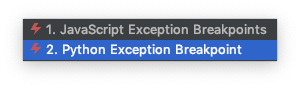
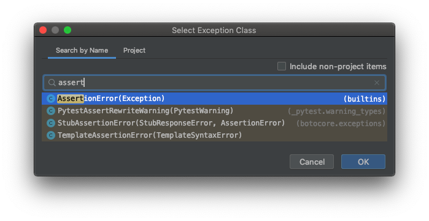

> 참조 포스팅  
> [https://velog.io/@ashe/Pycharm-에서-AssertionError-가-발생하면-브레이크-포인트를-멈추는-방법](https://velog.io/@ashe/Pycharm-에서-AssertionError-가-발생하면-브레이크-포인트를-멈추는-방법)

파이썬 코드의 테스트 중, assert구문에서 예외가 발생 하는 지점(Line)에 Breakpoint가 설정되어 있다면 예외가 일어난 시점에 대한 정보를 좀 더 쉽게 볼 수 있습니다.  
이 글에서는 따로 Breakpoint를 지정하지 않고도 AssertionError가 발생한 경우, 자동으로 PyCharm의 디버거가 해당 지점에서 멈추도록 하는 방법에 대해 설명합니다.

## Breakpoints설정

### 1. 기존 Exception Breakpoint해제

**cmd + shift + f8** 또는 **Run -> View Breakpoints...** 메뉴를 클릭합니다.

기존에 체크되어 있던 **Python Excpetion Breakpoint**를 해제하고, 위의 **+ 버튼**을 누릅니다.

### 2. AssertionError에 대한 새 Exception Breakpoint생성

**+ 버튼**을 누른 뒤, **Python Exception Breakpoint** 항목을 선택해줍니다

AssertionError를 검색 후 **OK**를 눌러 추가해줍니다

### 3. Activation policy설정

**On termination**은 체크 해제하며, **On raise**와 **Ignore library files**는 체크합니다.

## 사용 예

위는 Django test코드이며, **self.assertEqual**에서 AssertionError가 발생하자 Breakpoint없이 Debugger가 해당 라인에 멈춘 상태입니다.

## 마치며

API테스트를 짜며 예외가 발생하면 다시 해당 라인에 Breakpoint를 거는 작업을 반복하던 중, [같이 일하는 동료분](https://velog.io/@ashe)과 이런 기능이 IDE에 있지 않을까 하며 잠깐 찾아보다 발견했습니다.

방금 알게 된 기능이라 사용 중 개선 할 점이 있다면 이 글에 업데이트 할 예정입니다. 혹시 저희가 찾은 것 보다 더 좋은 방법으로 사용하고 계신분께서는 댓글로 알려주시면 감사하겠습니다!

