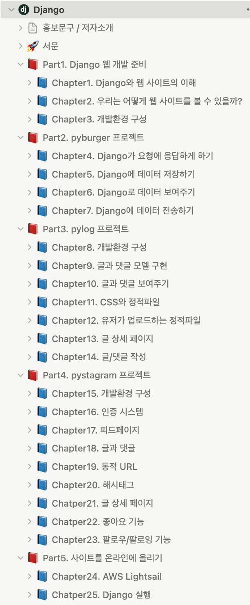
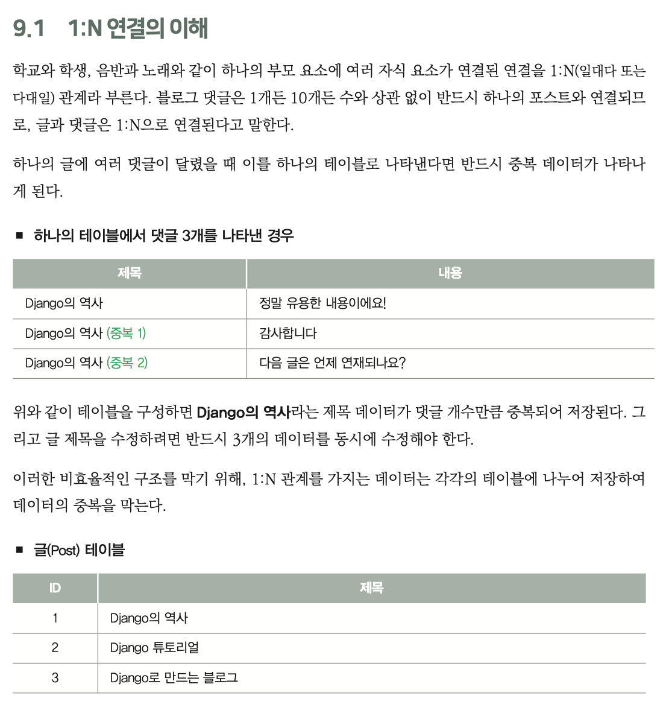
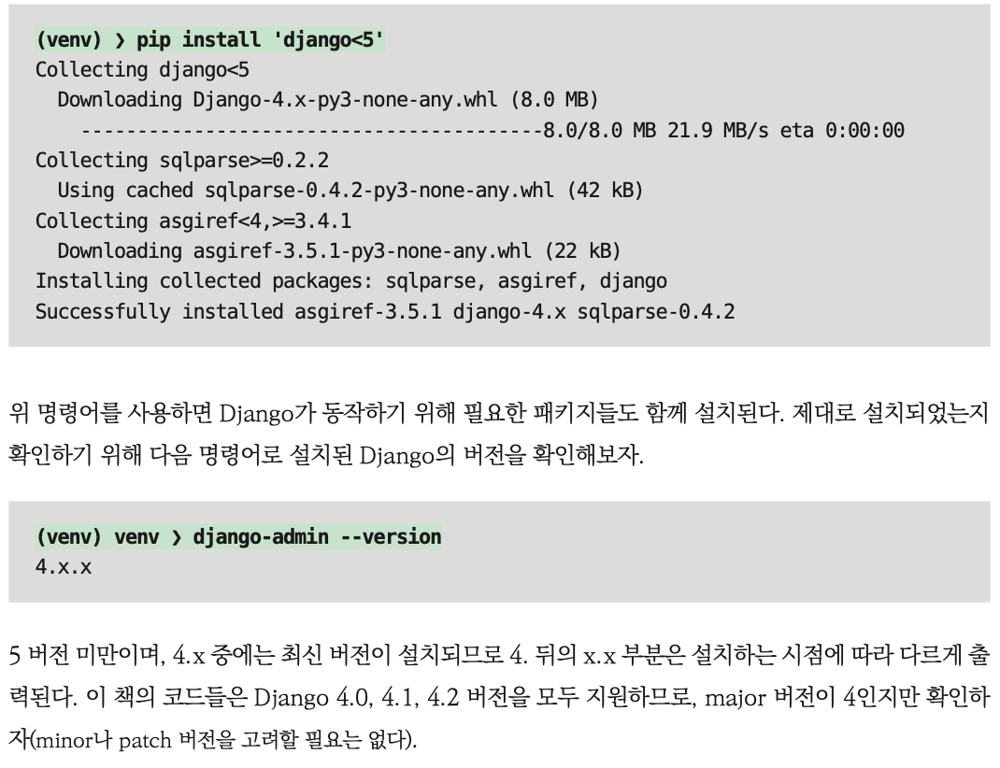
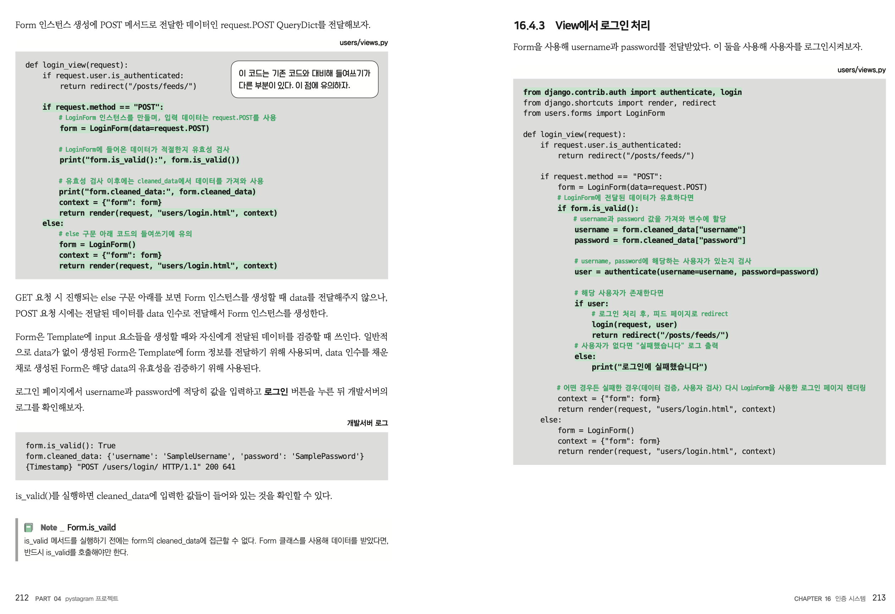
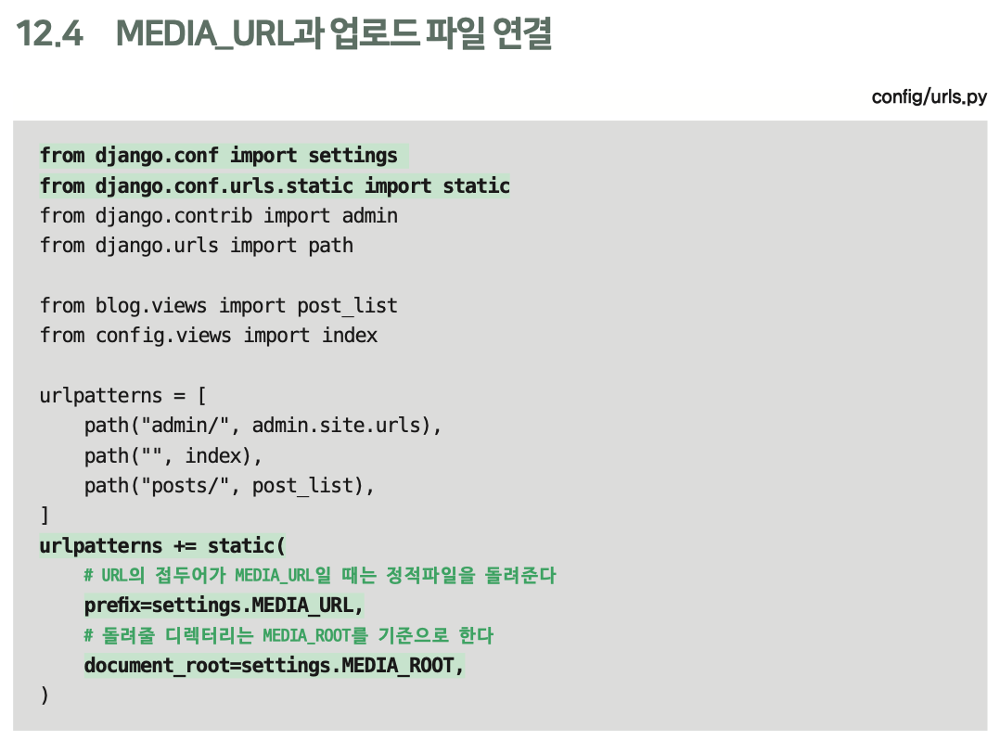
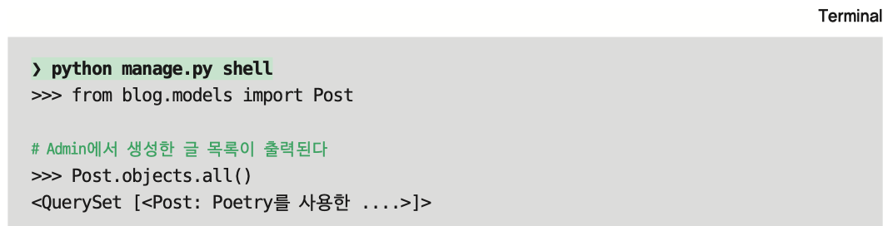
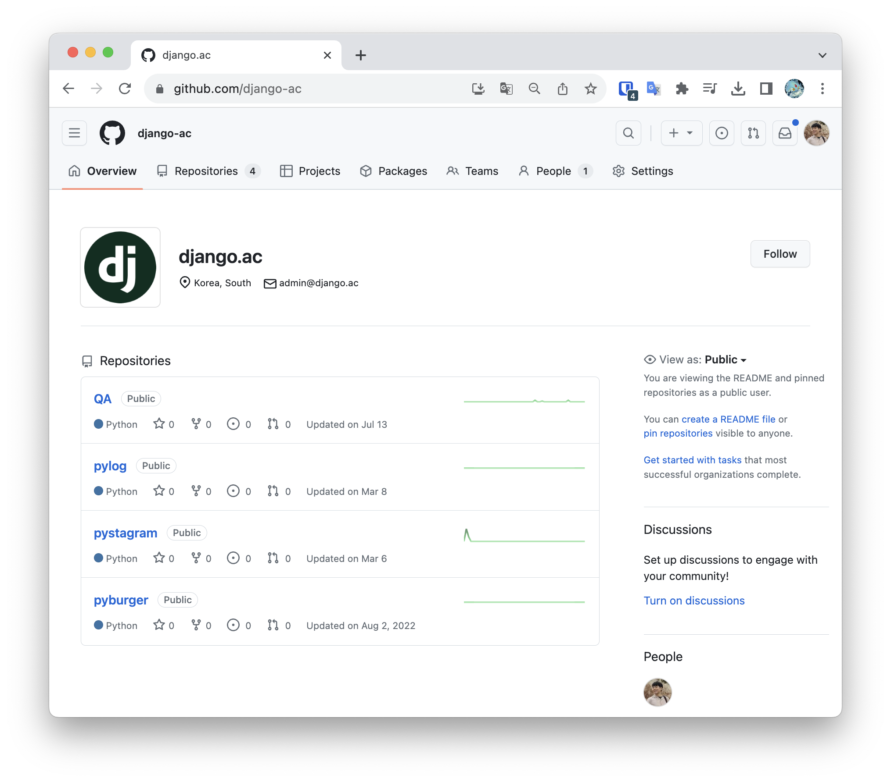
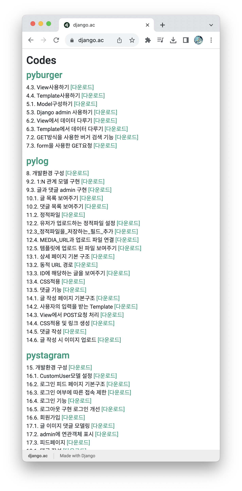

입문자용 Django책을 집필했습니다.

편집자님이 입문자 대상으로 강의하거나 글을 쓸 때 가장 중요하게 생각하는것이 뭐냐고 물어보셨는데, 일단 되는것을 만들어서 흥미를 잃지 않는것이 가장 중요하다고 했더니 책 소개 이미지를 이렇게 만들어주셨습니다.

입문자용 도서인 만큼, 제가 입문/초급수준에서 프로그래밍 도서를 보며 어려웠거나 별로라고 느꼈던 부분들을 해결하는데 많이 신경썼습니다. 사실, 입문자를 위해 세부적으로 신경 쓴 부분은 지금까지 제가 참고했던 **어떤 Django도서보다도** 뛰어나다고 자부합니다.

이 글에서는 책을 집필하며 특별히 신경쓴 부분들에 대해 소개합니다.

## 원고 선 집필 후 입문자 대상의 강의 진행

원고는 완성했지만, 실제 입문자들이 제가 쓴 책을 쉽게 볼 수 있을지를 검토해야했습니다.

> 마무리한 원고의 챕터 목록. 이때만 해도 끝난 줄 알았지만...

이를 위해 웹 프로그래밍을 정말 처음 접하는 입문자들을 대상으로 책 내용을 강의하며, 어려운 부분의 피드백을 받아 원고를 수정했습니다. 쉽게 쓴다고 썼는데도, 이 때 책에서 정말 많은 부분이 수정되었습니다. 

> **Django스터디 (22.07.22 ~ 23.01.13)**  
> 진행되었던 스터디 사진 중 일부. 이 스터디를 끝까지 참여해주신 분들께는 출판한 책 선물과 함께 책의 서두에 감사를 남겼습니다. 다시 한 번 감사드립니다.

## 배경지식 대신 Django자체에 집중

Django로 사이트를 만들기 위해서는 파이썬과 HTML, CSS, 기초 자바스크립트와 같은 별도의 배경지식들이 필요합니다. 대부분의 Django도서는 뒤에 나올 내용을 설명하기 위해 이 배경지식들에 페이지를 할애하고 있지만, 저는 이것이 불필요한 과정이라 생각했습니다.

시중에는 이미 많은 HTML/CSS와 자바스크립트 서적이 있고, Django책에서 알려주는 HTML/CSS는 한정적일 수 밖에 없습니다. 그중에서도 가장 필요없다고 생각한건 2~3페이지에 걸쳐서 보여주는 CSS코드입니다. 코드 한 줄 마다 어떤 변화가 있는지 보여준다면 의미가 있겠지만, 영상이 아닌 인쇄물에서는 어려운 일입니다.

제가 입문시절에 Django책이나 강의들을 따라해볼때, 너무 복잡한 HTML이나 CSS코드를 따라 치는것은 오히려 Django를 학습하는 과정의 몰입을 방해했습니다.

저는 Django책에서는 코드를 추가하고 바꿨을 때 "화면상에 어떤 변화가 있는지"를 보여주는것이 가장 우선이며, 그 화면을 "얼마나 예쁘게"만드는지는 HTML/CSS전문서적으로 따로 공부해야 하는 별도의 과정이라 생각합니다.

이를 위해 Django프로젝트에서 사용하는 CSS코드는 별도의 파일을 다운받아 첨부하도록 하였으며, 도서 내에서 HTML과 CSS에 대한 설명은 최소로 생략했습니다.

버전관리 시스템인 Git역시 Django를 이해하는 것과는 별개의 과정으로, 이 책에서는 Git없이 순수하게 Django만을 다루고 있습니다.

## 데이터베이스 구조 명시

웹 프레임워크 튜토리얼은 이미 데이터베이스 구조를 알고 있다는 전제하에 진행되는 경우가 많습니다. 예를 들면, 스프링이나 라라벨을 사용했던 사람이 Django튜토리얼을 접한다면 언어가 파이썬으로 바뀐 것 외에는 쉽게 진행할 수 있습니다.

하지만 "웹 프레임워크" 자체를 처음 접한 사람들은 데이터베이스 구조에 대한 이해가 필요합니다. 데이터베이스도 배경지식으로 삼아서 먼저 공부하라고 할 수도 있지만, 저는 모양을 구성하는 HTML/CSS와는 달리 Django를 학습하며 동시에 데이터베이스 구조를 익히는 것도 괜찮은 접근방법이라 생각합니다.

데이터베이스 구조에 대한 이해는 제가 Django에 입문할 때 가장 어려웠던 부분입니다.  
모델 코드를 구성하면 데이터베이스의 테이블이 어떤 형태를 가지게 되는지 스프레드시트의 표 형태로 설명하고, 새로운 Column을 추가하며 변경되는 모습과 새 데이터가 추가되었을 때 Row가 어떤식으로 쌓이는지, 다대일/다대다 연결들이 테이블데이터로 어떻게 저장되는지와 같이 데이터베이스의 변화를 이해하기 쉬운 형태로 알려주는 것에 중점을 두었습니다. 

> **1:N 관계를 설명하는 책 본문의 예시**  
> 

## 언제, 어떤 환경에서 시작하더라도 문제없는 실행

인쇄물로 출판된 코드는 수정할 수 없으나, 해당 프로그래밍 언어를 실행하는 환경은 시시각각으로 변화합니다. 파이썬 버전, OS종류와 버전, 실행하는 IDE의 변화, Django버전의 차이, 연관된 파이썬 패키지들의 업데이트와 같이 수많은 종속요소들이 있습니다.

경험자들은 이로 인해 발생하는 에러들을 쉽게 해결할 수 있으나, 입문자들은 쉽고 작은 오류라도 해결법을 찾기가 어렵습니다. 실제로, 2년 이상 지난 프로그래밍 서적들은 첫 프로젝트 시작 단계조차 책에 적혀있는대로 입력하면 실행이 안 되는 경우가 많습니다.

Django와 같은 백엔드 프레임워크는 일반적인 기능에서는 프론트엔드 프레임워크보다는 확실히 변화가 적습니다. 1.11버전의 Django와 2023년 현재 최신인 4.2버전은 6년의 차이가 있지만, 입문자를 위한 코드수준에서는 거의 변화가 없습니다. 즉, 오래전에 작성되었더라도 예제코드의 질이 높다면 Django버전과는 관계 없이 학습을 위해서 충분히 사용할 수 없습니다.

제가 본 책들에서는 프레임워크나 언어의 버전을 고정시키지 않고, 책이 출판 된 시점에 맞추어 설치 명령어를 사용하는 경우가 많았습니다. 경험자야 이때는 어느 버전을 사용했구나 하며 버전을 낮추어 설치하거나, 낮은 버전으로 인해 발생하는 오류를 수정하며 책을 진행할 수 있지만 입문자 입장에서는 이를 해결하는 것이 쉽지 않습니다.

이러한 문제를 근본적으로 해결하기 위해, 파이썬 버전이나 Django버전, 서드파티 라이브러리들을 설치 할 때 앞으로 새로운 버전이 나온다 하더라도 책을 쓴 시점과 동일한 버전의 파이썬/Django/서드파티 라이브러리를 사용하도록 설치 명령어를 구성했습니다.

> **미래에 설치하더라도 반드시 4.2.x버전이 설치되도록 설치 명령어를 제한한 예시**  
> 

라이브러리 버전과는 관계없이, IDE나 OS환경이 바뀌었을 경우에는 책을 위해 별도로 구성한 웹 사이트([https://django.ac](https://django.ac)) 에서 알려드리려고 합니다.

## 예제 코드의 가독성

### 들여쓰기

코드 블럭 구분을 위해 들여쓰기를 사용하는 파이썬에서 특히 문제되는 부분인데, 예제코드가 페이지를 넘어가면 가독성이 심하게 떨어집니다. 이를 방지하기 위해서는 모든 예제코드가 다른 페이지로 분리되지 않아야 하는데, 이를 위해 교정에 많은 시간이 소요되었습니다.

> **코드 블럭이 한 페이지 내에 구성 된 예제**  
> 

정말 불가피한 경우거나, 나뉘어져 있어도 문제가 되지 않는 코드 외에는 모두 위와 같이 각각의 예제들이 한 페이지 내에 구성될 수 있도록 신경썼습니다.

### 추가 된 코드의 강조표시

영상강의와는 달리, 인쇄물에서는 이전과 비교했을 때 어떤 코드가 추가되었는지 알기 쉽지않습니다. 추가된 코드에는 다른 색상으로 강조표시하여 가독성을 높였습니다.

> **강조 표시 된 코드**  
> 

추가 된 코드 외에도, 터미널에서 실제 입력하는 명령어와 로그를 헷갈리지 않도록 강조표시로 구분했습니다.

> **명령어와 로그 구분**  
> 

## 외부 링크의 단축 URL제공

책에서 다루는 코드와는 별개로, 공식문서나 외부 URL의 자료를 참고해야 할 때가 있습니다. 문서가 웹에 있다면 간단히 하이퍼링크를 연결하면 되겠지만, 인쇄물에서는 해당 링크의 문자열을 직접 타이핑해서 사이트에 접속해야합니다.

웹에서 사용하는 URL을 직접 입력하는 건 너무 번거로운 일입니다. 예를 들어, Django에서 CustomUser를 사용하는 방법에 대한 공식문서 URL은 아래와 같습니다.  
[https://docs.djangoproject.com/en/4.2/topics/auth/customizing/#using-a-custom-user-model-when-starting-a-project](https://docs.djangoproject.com/en/4.2/topics/auth/customizing/#using-a-custom-user-model-when-starting-a-project)

이 URL을 일일이 타이핑해서 페이지에 접속하는 대신 **별도로 생성한 단축 URL**을 사용해 접속할 수 있는 환경을 구성해놓았습니다. 위 URL은 아래와 같은 단축 URL로 접속할 수 있습니다.  
[https://docs.django.ac/models/custom-user](https://docs.django.ac/models/custom-user)

> 단축 URL을 공식문서로 redirect한 방법은 블로그의 다른글에서 다루고 있습니다.  
> **AWS Lambda와 API Gateway를 사용한 URL리다이렉션**  
> [https://lhy.kr/lambda-url-redirection](https://lhy.kr/lambda-url-redirection)

## 챕터별로 분리된 소스코드 링크

입문자는 매 챕터마다 코드가 어떻게 변경되었는지 봐야 할 때가 있습니다. 책에서 경로를 설명했어도 다른 경로에 파일을 만들 수도 있으며, 책과는 다른 오타가 발생했을 때 비교하기 위한 완성코드가 필요할 때도 있습니다.

전체 프로젝트가 완성된 시점의 코드에는 중간중간에 학습을 위해 작성되었다가 삭제된 코드들이 포함되지 않습니다. 이 책에서는 Git의 버전태그를 사용해 각 챕터별로 별도의 다운로드 링크가 존재하며, 독자는 원하는 시점의 코드를 언제든 다운받아 확인 할 수 있습니다.

> 책의 프로젝트 코드를 모아놓은 GitHub Organization  
> **[https://github.com/django-ac](https://github.com/django-ac)**
>
> 

> 각 챕터별로 구분 된 다운로드 링크  
> 

## 집필 후기

이 책은 Django를 처음 접하던 시절의 제가 겪었던 어려움을 해결하는 것을 가장 중요시했습니다.

많은 것을 담다보니 중후반부에서부터는 절대 쉬운 난이도라고는 할 수 없지만, 웹 프레임워크를 처음 접하는 분들이 이 책을 따라하며 **Django로 이런것을 할 수 있구나** 라는 것을 막힘없이 진행해보는 경험이 되었으면 합니다.
