이번 시리즈에서는 Django프로젝트를 웹 서버 - WSGI - 애플리케이션구조로 컨테이너화 하고, 정적파일과 DB를 애플리케이션과 분리하며 도메인을 연결하고 SSL인증서를 발급받아 HTTPS를 적용하는 전반적인 배포 프로세스를 다룹니다.

[집필한 Django도서](https://lhy.kr/lhy-django)에는 프로젝트를 웹에 공개할 때, runserver를 사용한 간단한 배포를 체험해보는 수준만 수록되어 있습니다. 기초적인 선에서는 크게 변하지 않는 Django사용법과 달리, 배포에 사용되는 기술은 유행에 따라 자주 변경되므로 도서보다는 계속해서 업데이트 할 수 있는 웹 상에서 공개하는 방향으로 결정했습니다.

본 배포설명은 책의 내용을 진행해 보았다는 전제하에 쓰였습니다. 도서를 읽지 않으신 분들은 웹에 공개되어있는 내용 중 [Chapter3. 개발환경 구성](https://lhy.kr/django/intro/ch3-dev-setup)을 보고 오시는 것을 추천드립니다.  
추가적으로, 책은 메이저 버전 4의 Django를 다루고 있습니다. 23년 12월에 5.0이 출시되었지만, 현 시점에 도서 내용을 따라하여도 문제없도록 호환성을 고려했습니다. 학습을 위해서라면 책의 내용은 최소 5년은 큰 문제가 없을것입니다.

배포과정은 다음 순서로 진행됩니다.


1. **Django프로젝트 세팅 (현 포스트)** 
   - Django 설치 및 초기설정
   - 개발환경 정적파일 설정
   - 개발환경 동작 확인
   - 디버그 모드
2. **배포환경에서의 정적파일 제공**
   - 소스코드에 포함된 정적파일 제공
     - WhiteNoise
     - WSGI서버를 사용한 Django실행
   - 유저가 업로드한 정적파일 제공
     - Docker
     - 웹 서버를 사용한 정적파일 제공
3. **Docker를 사용한 runserver실행**
   - Docker설치 및 실행 확인
   - Django프로젝트를 Docker Image로 변환
   - docker명령어로 runserver실행
4. **Docker Compose를 사용한 다수 컨테이너 관리**
   - 로컬에서 Gunicorn을 사용해 Django애플리케이션 실행
   - docker명령어로 Gunicorn실행
   - docker명령어로 Nginx실행
   - docker명령어로 Nginx와 Gunicorn을 동일 네트워크에서 연결
   - Docker Compose로 Nginx와 Gunicorn을 동시 실행
5. **Django외부로 DB와 정적파일 분리**
   - Compose에 PostgreSQL서비스 추가
   - Amazon S3로 정적파일 저장소 분리
6. **SSL인증**
   - Let's Encrypt를 사용한 인증서 발급
   - 인증서를 사용해 HTTPS접속 설정
   - Docker이미지를 사용한 자동화


## 1. Django 설치 및 초기설정

### 1-1 .Django 설치

**PyCharm프로젝트 설정 및 설치 명령어 실행**

```shell
# PyCharm으로 "deploy"프로젝트를 생성한 후, 터미널에서 실행
❯ pwd
/Users/lhy/PycharmProjects/deploy

# Django 설치
❯ pip install 'django<5'
Collecting django<5
  Obtaining dependency information for django<5 from
...
Installing collected packages: sqlparse, asgiref, django
Successfully installed asgiref-3.7.2 django-4.2.11 sqlparse-0.4.4

# 프로젝트 구조 생성
❯ django-admin startproject config .
```


**프로젝트 구조 확인**

```
# 저장공간에서 프로젝트의 위치
# ~/PyCharmProjects/deploy
deploy
├── config
│   ├── __init__.py
│   ├── asgi.py
│   ├── settings.py
│   ├── urls.py
│   └── wsgi.py
└── manage.py
```


### 1-2. Index페이지 구성

**TEMPLATES_DIR설정**

```python
## config/settings.py ##
TEMPLATES_DIR = BASE_DIR / "templates"
...
TEMPLATES = [
    {
        ...
        "DIRS": [TEMPLATES_DIR],
```


**View**

```python
## config/views.py (새로 생성) ##
from django.shortcuts import render

def index(request):
    return render(request, "index.html")
```


**URLconf**

```python
## config/urls.py ##
from django.contrib import admin
from django.urls import path

from config.views import index

urlpatterns = [
    path("admin/", admin.site.urls),
    path("", index),
]
```


**Template**

```html
<!-- templates/index.html (새로 생성) -->
<!doctype html>
<html lang="ko">
<body>
    <h1>deploy</h1>
</body>
</html>
```


**runserver실행 후 localhost:8000에서 Index View동작 확인**

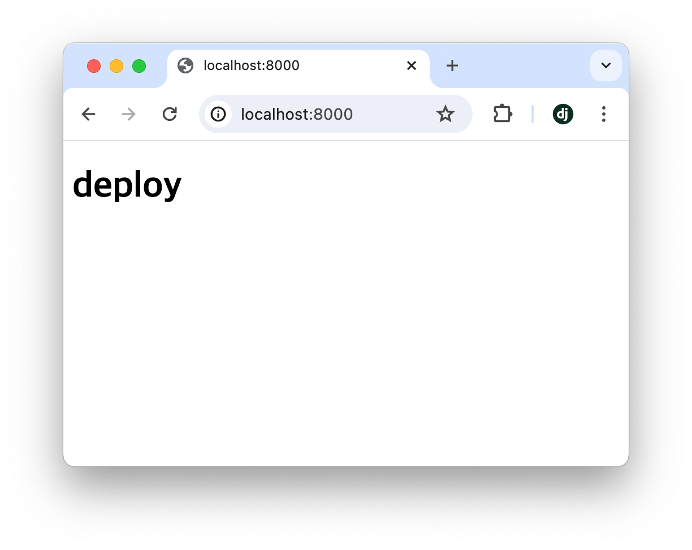


### 1-3. sample app 및 모델 생성

**Pillow설치, sample app생성 &등록**

```shell
## Terminal ##
# ImageField를 사용할 것이므로, 미리 Pillow설치
❯ pip install 'pillow<10'
...
Successfully installed pillow-9.5.0

# "sample"앱 생성
❯ python manage.py startapp sample

# 이후 프로젝트 구조
~/PycharmProjects/deploy
├── sample
│   ├── migrations/
│   ├── __init__.py
│   ├── admin.py
│   ├── apps.py
│   ├── models.py
│   ├── tests.py
│   └── views.py
├── config/
└── manage.py
```

```python
## config/settings.py ##
# 생성한 앱 등록
INSTALLED_APPS = [
    ...
    "sample",
]
```


**모델 생성**

```python
## sample/models.py ##
from django.db import models

class SamplePost(models.Model):
    post_image = models.ImageField()
```


**DB변경사항 생성 및 적용**

```shell
## Terminal ##
# DB 변경사항 생성
❯ python manage.py makemigrations
Migrations for 'sample':
  sample/migrations/0001_initial.py
    - Create model SamplePost

# DB 변경사항 적용
❯ python manage.py migrate       
Operations to perform:
  Apply all migrations: admin, auth, contenttypes, sample, sessions
Running migrations:
  ...
  Applying sample.0001_initial... OK
```


**모델의 admin등록**

```python
## sample/admin.py ##
from django.contrib import admin
from sample.models import SamplePost

@admin.register(SamplePost)
class SamplePostAdmin(admin.ModelAdmin):
    pass
```


**실행확인**

```shell
## Terminal ##
# superuser생성
❯ python manage.py createsuperuser
Username: lhy
Email address: 
Password: 
Password (again): 
Superuser created successfully.

# runserver실행
❯ python manage.py runserver
```


**runserver 실행 후 admin페이지 (http://localhost:8000/admin)에 접속, 생성한 superuser계정으로 로그인**

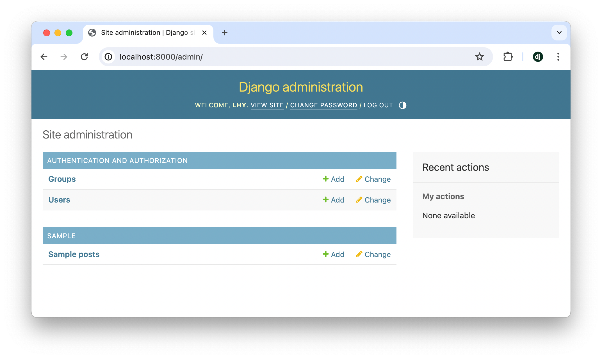

## 2. 개발환경 정적파일 설정

### 2-1. 소스코드에 포함된 정적파일 설정

```python
## config/settings.py ##
STATIC_URL = "static/"
STATICFILES_DIRS = [BASE_DIR / "static"]
STATIC_ROOT = BASE_DIR / "_static"
```

```
## 프로젝트 구조 ##
# deploy디렉터리 아래에 "static"디렉터리를 생성해준다.
deploy
├── config/
├── sample/
├── static/   <- 생성
└── manage.py
```


### 2-2. 유저가 업로드하는 정적파일 설정

```python
## config/settings.py ##
MEDIA_URL = "media/"
MEDIA_ROOT = BASE_DIR / "_media"
```

```python
## config/urls.py ##
from django.conf import settings            # 추가
from django.conf.urls.static import static  # 추가
from django.contrib import admin
from django.urls import path

from config.views import index

urlpatterns = [
    path("admin/", admin.site.urls),
    path("", index),
]
# 아래 코드블록 추가
urlpatterns += static(
    prefix=settings.MEDIA_URL,
    document_root=settings.MEDIA_ROOT,
)
```


## 3. 개발환경 동작 확인

### 3-1. static경로(소스코드에 포함된)의 정적파일 확인

[링크](https://f.django.ac/deploy/favicon.ico)의 파비콘 파일을 다운로드하여 static디렉터리에 추가

```
## 프로젝트 구조 ##
deploy
├── ...
├── static/
│   └── favicon.ico  # 이 위치에 추가
└── ...
```

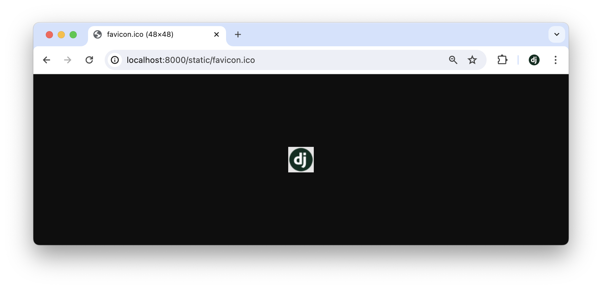
브라우저에서 http://localhost:8000/static/favicon.ico 표시 확인
{:img-caption}


**index.html에서 favicon파일을 사용하도록 HTML수정**

```html

<!-- templates/index.html -->

<!doctype html>
<html lang="ko">
<head>
    <link rel="icon" type="image/x-icon" href="">
</head>
<body>
    <h1>deploy</h1>
</body>
</html>

```

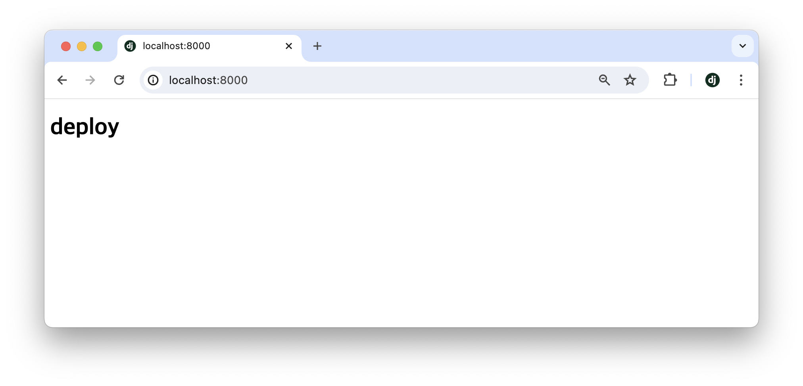
탭 좌측에 추가한 favicon표시 확인
{:img-caption}


### 3-2. media경로(유저가 업로드한)의 정적파일 확인

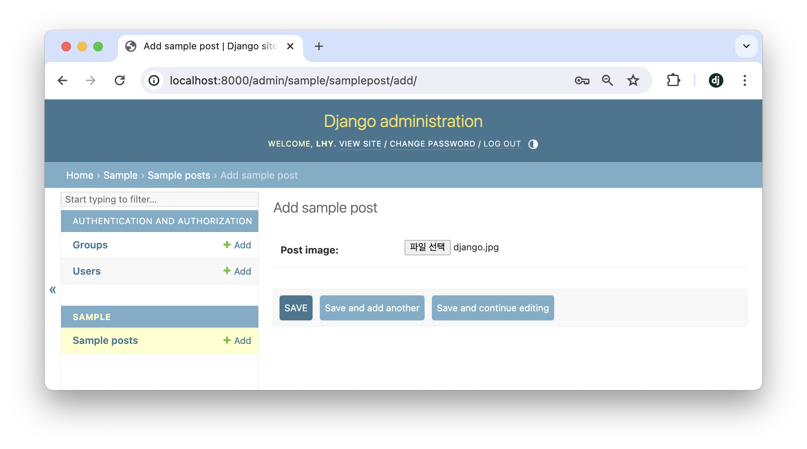
적당한 이미지파일을 선택, 새 SamplePost객체 생성
{:.img-caption}

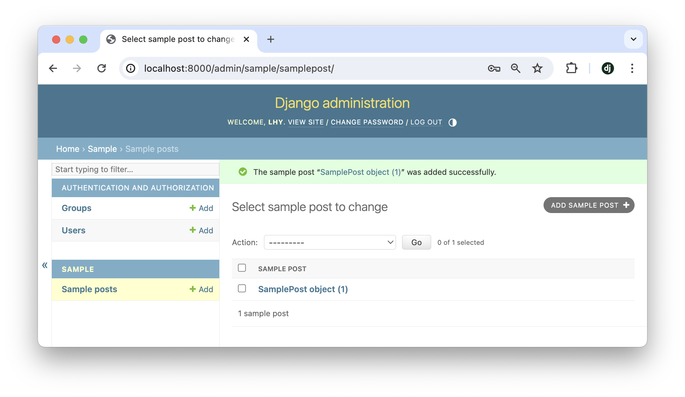
생성된 SamplePost객체 링크 클릭
{:.img-caption}

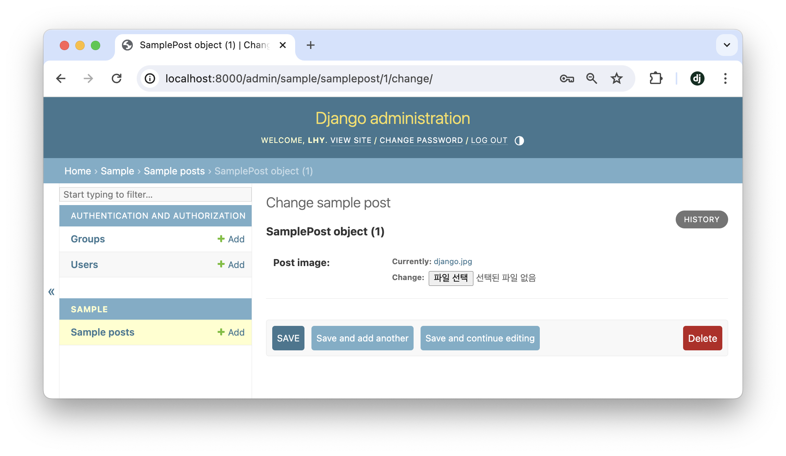
SamplePost객체 상세화면의 이미지 링크 클릭
{:.img-caption}

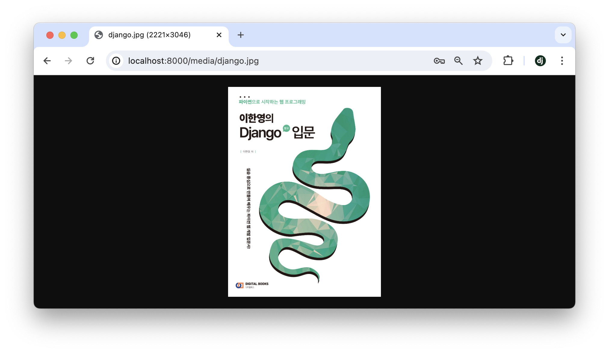
/media/링크의 이미지 표시 확인
{:.img-caption}


## 4. 디버그 모드

Django의 정적파일 제공기능은 개발환경에서의 편의성을 위해서 사용하는 것이며, 디버그 모드에서만 동작합니다. 디버그 모드는 settings.py의 DEBUG변수로 설정하며, 기본값이 True로 활성화되어있습니다.

디버그 모드를 해제하면 정적파일과 관련된 기능이 동작하지 않습니다. 이를 확인해보도록 합니다.

### 4-1. 디버그 모드 해제

```python
## settings.py ##
DEBUG = False  # 기본값은 True
```


이대로 runserver를 실행하려하면 오류메세지가 출력됩니다.

```shell
## Terminal ##
❯ python manage.py runserver
CommandError: You must set settings.ALLOWED_HOSTS if DEBUG is False.
```


디버그 모드가 해제되었을 때는, 반드시 `ALLOWED_HOSTS`배열에 값이 설정되어야합니다. `ALLOWED_HOSTS`는 Django로의 접속을 허용할 도메인 목록이며, 기본값은 비어있습니다. 지금은 로컬 환경에서 Django를 실행하고 있으므로, 배열에 `localhost`를 추가합니다.

```python
## settings.py ##
DEBUG = False
ALLOWED_HOSTS = ["localhost"]  # 기본값은 빈 배열 []
```


다시 runserver를 실행합니다.

```shell
## Terminal ##
❯ python manage.py runserver
Performing system checks...

System check identified no issues (0 silenced).
March 23, 2024 - 07:15:30
Django version 4.2.11, using settings 'config.settings'
Starting development server at http://127.0.0.1:8000/
Quit the server with CONTROL-C.
```


### 4-2. static경로(소스코드에 포함된)의 정적파일 기능 중단 확인

관리자페이지(http://localhost:8000/admin/)로 접속 후, `cmd + shift + r`로 캐시를 삭제하며 페이지를 새로고침합니다. CSS스타일이 적용되지 않은 페이지가 나타납니다.

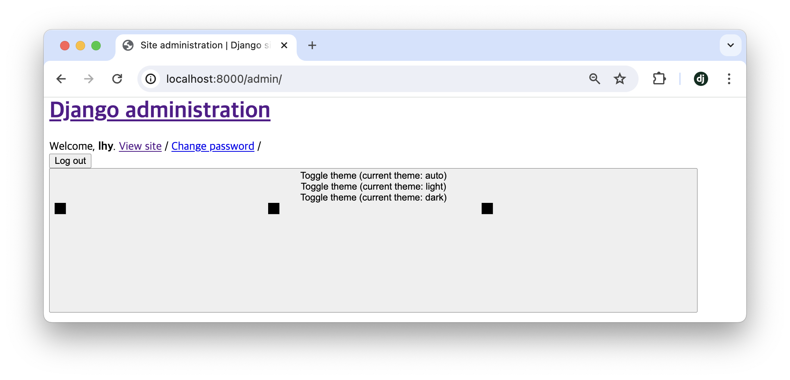
css, js와 같은 정적파일이 적용되지 않은 관리자 페이지
{:img-caption}

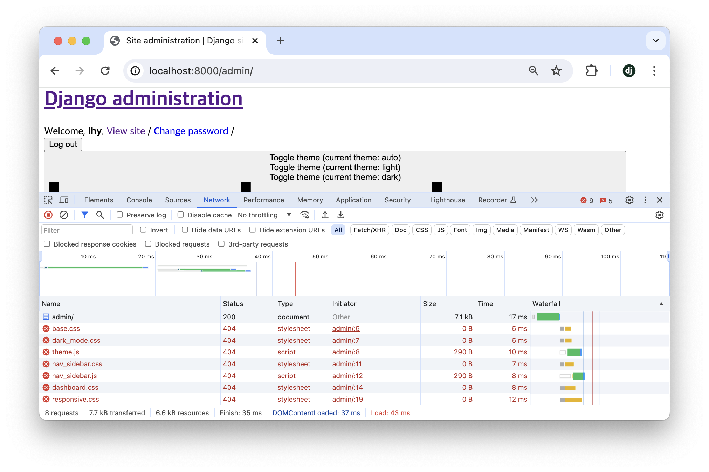
개발자 도구 (cmd + option + i)를 켜고 새로고침 하면 css파일을 찾을 수 없다는 에러(404)가 발생함을 알 수 있습니다.
{:img-caption}


### 4-3. media경로(유저가 업로드한)의 정적파일 기능 중단 확인

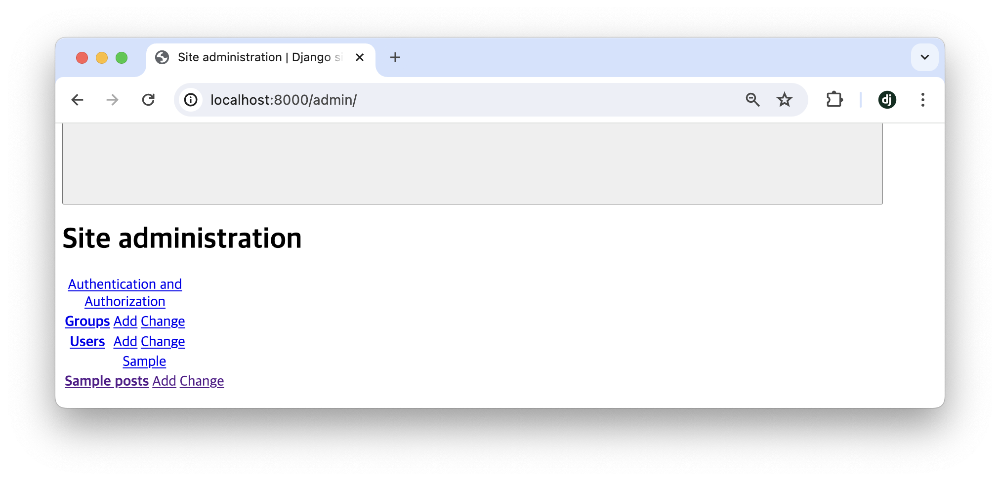
아래로 내려 Sample posts링크를 클릭합니다
{:img-caption}

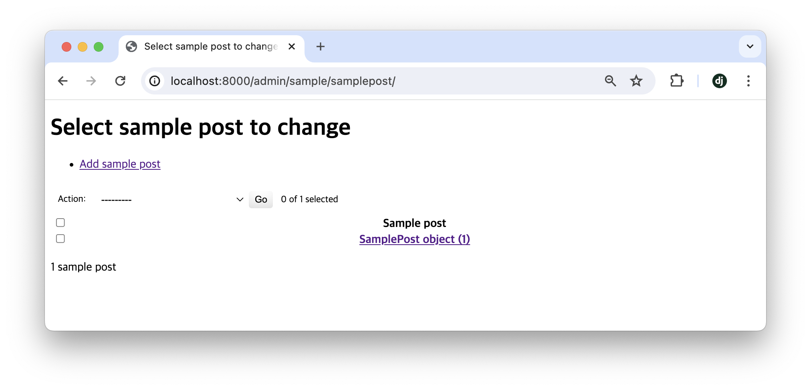
SamplePost object (1)을 클릭합니다
{:img-caption}

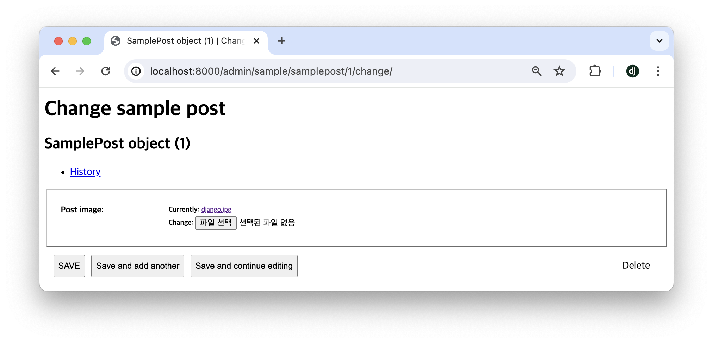
Currently: django.jpg링크를 클릭합니다
{:img-caption}

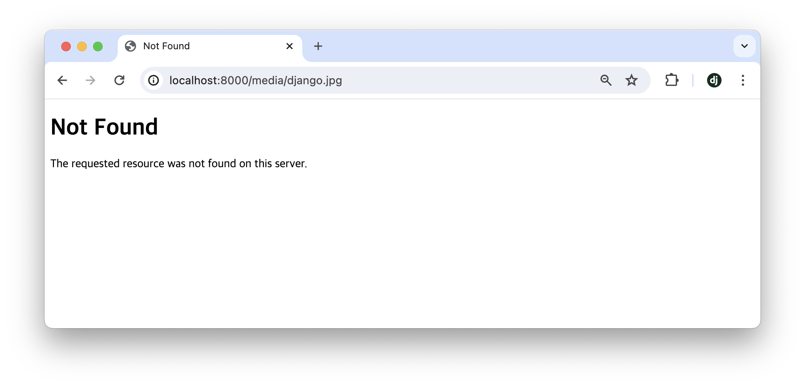
파일을 찾을 수 없다는 메세지가 나타납니다
{:img-caption}

이와 같이, 디버그 모드를 해제하면 소스코드에 포함되었던, 유저가 업로드하였던간에 상관없이 모든 정적파일 제공 기능이 사라집니다. 디버그 모드에서의 정적파일 제공기능은 편리하지만, 실제 배포환경에서 사용하기에는 느리고 비효율적인 문제가 있습니다. 다음 편에서는 디버그 모드가 해제되었을 때 정적파일을 제공하는 방법에 대해 알아봅니다.